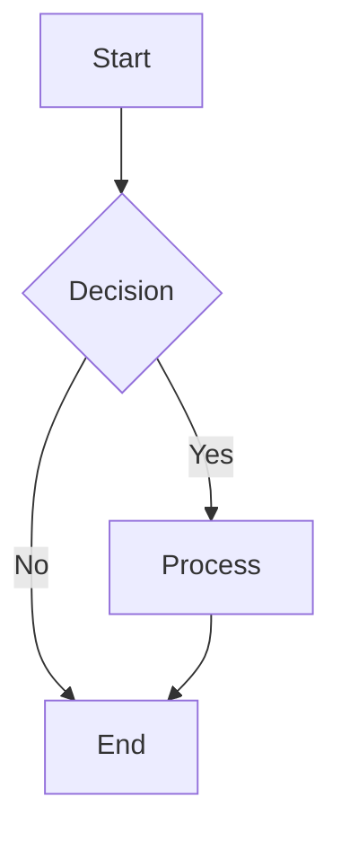

# Contributing to Interview Bank

Thank you for your interest in contributing to the Interview Bank! This document provides guidelines and best practices for contributing high-quality interview questions and code examples.

## 📋 Table of Contents

- [Getting Started](#getting-started)
- [Types of Contributions](#types-of-contributions)
- [Question Guidelines](#question-guidelines)
- [Code Standards](#code-standards)
- [Documentation Standards](#documentation-standards)
- [Submission Process](#submission-process)
- [Review Process](#review-process)

## 🚀 Getting Started

### Prerequisites

1. Fork the repository
2. Clone your fork locally
3. Create a new branch for your contribution
4. Review existing questions in the relevant domain

### Directory Structure

```
interview-bank/
├── [domain-name]/
│   ├── README.md              # Domain overview
│   ├── questions.md           # Main questions file
│   ├── INDEX.md              # Question index (if applicable)
│   └── code-examples/        # Production code examples (if applicable)
└── templates/                # Use these as starting points
```

## 🎯 Types of Contributions

We welcome the following types of contributions:

### 1. New Interview Questions

- Well-structured questions with clear requirements
- Real-world scenarios and use cases
- Multiple difficulty levels
- Complete solutions with explanations

### 2. Code Examples

- Production-quality implementations
- Proper error handling and edge cases
- Security best practices
- Performance considerations

### 3. Architecture Diagrams

- System design diagrams (Mermaid or ASCII)
- Component interaction flows
- Deployment architectures
- Data flow diagrams

### 4. Documentation Improvements

- Clearer explanations
- Additional examples
- Better organization
- Typo fixes and clarity improvements

### 5. Templates

- Reusable question formats
- Code snippet templates
- Diagram templates

## 📝 Question Guidelines

### Structure

Every interview question should follow this structure:

```markdown
### Question [Number]: [Title]

**Difficulty**: ⭐/⭐⭐/⭐⭐⭐/⭐⭐⭐⭐ [Level]  
**Topic**: [Main Topic]  
**Tags**: `tag1`, `tag2`, `tag3`

#### Question
[Clear statement of what needs to be solved]

#### Requirements
- [Specific requirement 1]
- [Specific requirement 2]
- [Constraint or consideration]

#### Architecture (if applicable)
[Mermaid diagram or ASCII art showing system design]

#### Solution
[Complete implementation with explanations]

#### Explanation
[Why this solution works, trade-offs, alternatives]

#### Usage Example
[How to use the implementation]
```

### Difficulty Levels

| Level | Symbol | Time | Focus |
|-------|--------|------|-------|
| **Basic** | ⭐ | 15-30 min | Fundamentals, syntax, basic patterns |
| **Intermediate** | ⭐⭐ | 30-45 min | Practical application, common patterns |
| **Advanced** | ⭐⭐⭐ | 45-60 min | Complex scenarios, architectural decisions |
| **Expert** | ⭐⭐⭐⭐ | 60-90 min | System design, production-grade solutions |

### Best Practices

#### ✅ DO:

- Base questions on real production scenarios
- Provide complete, working code examples
- Include error handling and edge cases
- Explain trade-offs and alternatives
- Add security considerations where relevant
- Use proper type hints and documentation
- Include architecture diagrams for complex systems
- Test all code examples before submitting
- Add references to official documentation

#### ❌ DON'T:

- Create trivial or theoretical questions
- Include incomplete or pseudocode
- Ignore error handling
- Skip security considerations
- Use outdated patterns or deprecated features
- Add questions without proper context
- Submit untested code
- Plagiarize from other sources

## 💻 Code Standards

### General Principles

1. **Production Quality**: Code should be production-ready, not just examples
2. **Security First**: Always consider security implications
3. **Performance**: Optimize for common use cases
4. **Maintainability**: Write clean, readable, well-documented code
5. **Testing**: Include test examples where appropriate

### Language-Specific Standards

#### TypeScript/JavaScript

```typescript
// ✅ Good: Proper typing, error handling, documentation
/**
 * Fetches user data with retry logic
 * @param userId - The user's unique identifier
 * @returns Promise resolving to user data
 * @throws {Error} When user not found after all retries
 */
async function getUser(userId: string): Promise<User> {
  try {
    return await fetchWithRetry(`/api/users/${userId}`);
  } catch (error) {
    logger.error('Failed to fetch user', { userId, error });
    throw new Error(`User ${userId} not found`);
  }
}

// ❌ Bad: No types, no error handling
async function getUser(id) {
  return fetch(`/api/users/${id}`).then(r => r.json());
}
```

#### PHP

```php
// ✅ Good: Type hints, return types, error handling
final class UserService
{
    public function __construct(
        private readonly UserRepository $repository,
        private readonly LoggerInterface $logger
    ) {}

    /**
     * Retrieve a user by ID
     *
     * @throws UserNotFoundException
     */
    public function findUser(string $id): User
    {
        try {
            return $this->repository->findById($id);
        } catch (NotFoundException $e) {
            $this->logger->error('User not found', ['id' => $id]);
            throw new UserNotFoundException("User {$id} not found", 0, $e);
        }
    }
}

// ❌ Bad: No types, no error handling
class UserService
{
    public function findUser($id)
    {
        return $this->repository->findById($id);
    }
}
```

#### Python

```python
# ✅ Good: Type hints, docstrings, error handling
from typing import Optional
from dataclasses import dataclass

@dataclass
class User:
    """Represents a user in the system"""
    id: str
    email: str
    name: str

class UserService:
    """Service for managing user operations"""
    
    def __init__(self, repository: UserRepository):
        self.repository = repository
    
    def get_user(self, user_id: str) -> Optional[User]:
        """
        Retrieve a user by ID
        
        Args:
            user_id: The user's unique identifier
            
        Returns:
            User object if found, None otherwise
            
        Raises:
            ValueError: If user_id is invalid
        """
        if not user_id:
            raise ValueError("user_id cannot be empty")
        
        return self.repository.find_by_id(user_id)

# ❌ Bad: No types, no documentation
class UserService:
    def get_user(self, id):
        return self.repository.find_by_id(id)
```

### Code Comments

```typescript
// ✅ Good: Explain WHY, not WHAT
// Use exponential backoff to avoid overwhelming the server
// during high load periods
const delay = baseDelay * Math.pow(2, attempt);

// ❌ Bad: Stating the obvious
// Multiply baseDelay by 2 to the power of attempt
const delay = baseDelay * Math.pow(2, attempt);
```

### Security Considerations

Always include security notes for sensitive operations:

```typescript
// SECURITY: Validate and sanitize all user input
const sanitizedInput = validator.escape(userInput);

// SECURITY: Use parameterized queries to prevent SQL injection
const result = await db.query(
  'SELECT * FROM users WHERE id = $1',
  [userId]
);

// SECURITY: Hash passwords using bcrypt with appropriate cost factor
const hashedPassword = await bcrypt.hash(password, 12);
```

## 📚 Documentation Standards

### Markdown Formatting

#### Headers

```markdown
# Main Title (H1) - Once per file
## Section (H2) - Major sections
### Subsection (H3) - Topics
#### Details (H4) - Specific items
```

#### Code Blocks

Always specify the language:

````markdown
```typescript
// Your code here
```

```python
# Your code here
```

```yaml
# Your YAML here
```
````

#### Mermaid Diagrams

Use Mermaid for architecture diagrams:

````markdown

````

#### Tables

```markdown
| Header 1 | Header 2 | Header 3 |
|----------|----------|----------|
| Cell 1   | Cell 2   | Cell 3   |
| Cell 4   | Cell 5   | Cell 6   |
```

## 🔄 Submission Process

### 1. Prepare Your Contribution

- [ ] Create a new branch: `git checkout -b feature/your-contribution-name`
- [ ] Add your questions/code following the guidelines
- [ ] Test all code examples
- [ ] Update relevant INDEX.md files
- [ ] Check for typos and formatting issues

### 2. Commit Your Changes

Use clear, descriptive commit messages:

```bash
# Good commit messages
git commit -m "Add React Server Components question with examples"
git commit -m "Fix TypeScript types in LLM service example"
git commit -m "Update K8s deployment with security best practices"

# Bad commit messages
git commit -m "Update"
git commit -m "Fix stuff"
git commit -m "Changes"
```

### 3. Push and Create Pull Request

```bash
git push origin feature/your-contribution-name
```

Then create a pull request with:

**Title**: Clear, descriptive title of changes
```
Add 5 advanced Kubernetes questions with production examples
```

**Description**: Detailed explanation
```markdown
## Changes
- Added 5 new Kubernetes questions (Advanced level)
- Includes production-ready YAML manifests
- Added Prometheus monitoring examples
- Updated INDEX.md with new questions

## Testing
- All YAML validated with kubectl
- Code examples tested in K8s cluster
- Documentation reviewed for clarity

## Related Issues
Closes #123
```

## 🔍 Review Process

### What We Look For

1. **Quality**: Production-ready, well-tested code
2. **Completeness**: Full solutions with explanations
3. **Clarity**: Clear, easy to understand
4. **Security**: Proper security considerations
5. **Consistency**: Follows existing patterns and style

### Review Timeline

- Initial review: Within 3-5 business days
- Feedback provided: Within 1 week
- Final approval: After all feedback addressed

### Addressing Feedback

- Respond to all review comments
- Make requested changes
- Push updates to the same branch
- Re-request review when ready

## 🎯 Quality Checklist

Before submitting, ensure:

- [ ] Question follows the template structure
- [ ] Difficulty level is appropriate and marked
- [ ] Code is complete and tested
- [ ] All dependencies are documented
- [ ] Error handling is included
- [ ] Security considerations are addressed
- [ ] Architecture diagrams included (if applicable)
- [ ] Usage examples provided
- [ ] Documentation is clear and thorough
- [ ] No typos or grammatical errors
- [ ] Updated INDEX.md (if adding new questions)
- [ ] All code follows language-specific standards

## 🙏 Thank You!

Your contributions help create a valuable resource for the developer community. We appreciate your time and effort in maintaining high-quality content!

## 📞 Questions?

If you have questions about contributing:

1. Check existing questions in the relevant domain
2. Review the templates in `/templates/`
3. Open an issue for clarification
4. Reach out to maintainers

---

**Happy Contributing! 🚀**
