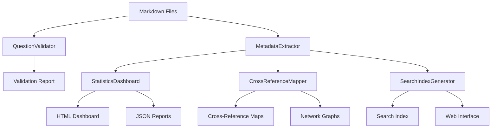
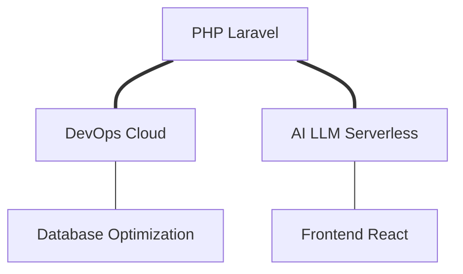
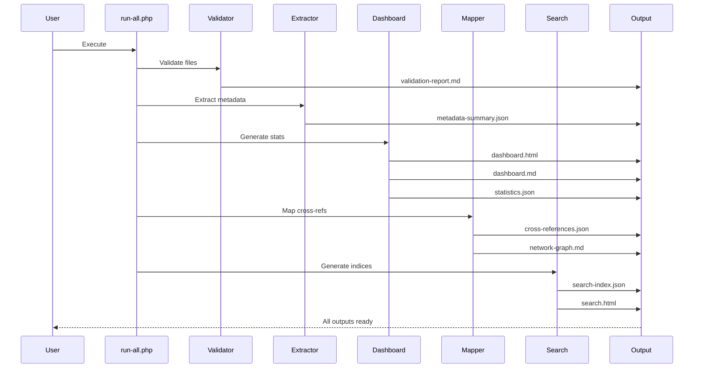

# Interview Bank Automation - Implementation Details

## Architecture Overview

The automation suite consists of 5 main components that work together to validate, analyze, and index the interview question bank.



## Component Details

### 1. QuestionValidator

**Purpose**: Validates markdown syntax, code blocks, and Mermaid diagrams

**Key Methods**:
- `validateMarkdownFile(string $filePath): array`
- `validateCodeBlocks(string $content, string $filePath): void`
- `validateMermaidDiagrams(string $content, string $filePath): void`
- `generateReport(array $results): string`

**Validation Rules**:

```php
// PHP Syntax Validation
php -l temp_file.php

// JSON Validation
json_decode($code);
json_last_error() === JSON_ERROR_NONE

// Mermaid Diagram Types
['graph', 'flowchart', 'sequenceDiagram', 'classDiagram', 
 'stateDiagram', 'erDiagram', 'gantt', 'pie']
```

**Output**:
- `validation-report.md`: Human-readable report
- Categorized errors and warnings
- Statistics on code blocks and diagrams

### 2. MetadataExtractor

**Purpose**: Extracts structured metadata from markdown files

**Extracted Data**:
```php
[
    'file_path' => string,
    'difficulty' => 'basic|intermediate|advanced|expert',
    'technologies' => [
        ['name' => 'PHP', 'mentions' => 42],
        ['name' => 'Laravel', 'mentions' => 38]
    ],
    'topics' => ['Webhooks', 'API Security'],
    'questions' => [
        ['number' => 1, 'text' => '...', 'type' => 'numbered']
    ],
    'code_examples' => [
        ['language' => 'php', 'lines' => 25]
    ],
    'mermaid_diagrams' => [
        ['type' => 'flowchart', 'lines' => 15]
    ]
]
```

**Difficulty Detection Algorithm**:
```php
foreach ($difficultyPatterns as $level => $patterns) {
    foreach ($patterns as $pattern) {
        // Check filename
        if (preg_match($pattern, $fileName)) {
            $scores[$level] += 3;
        }
        // Check content
        $scores[$level] += preg_match_all($pattern, $content);
    }
}
```

**Technology Patterns**:
- 50+ predefined patterns
- Case-insensitive matching
- Counts mentions per file
- Tracks related technologies

### 3. StatisticsDashboard

**Purpose**: Generates comprehensive statistics and visualizations

**Output Formats**:

1. **Markdown Dashboard**
   - Overview metrics
   - Difficulty distribution with ASCII bars
   - Domain breakdown tables
   - Technology matrix
   - Code statistics

2. **JSON Report**
   ```json
   {
     "generated_at": "2024-02-04T18:30:00+00:00",
     "summary": {
       "total_files": 87,
       "total_questions": 3542,
       "total_code_blocks": 892
     },
     "difficulty_distribution": {...},
     "domain_breakdown": {...},
     "technology_coverage": {...}
   }
   ```

3. **HTML Dashboard**
   - Interactive interface
   - Responsive design
   - Colored metrics cards
   - Sortable tables
   - Progress bars

**Key Metrics**:
- Questions per file ratio
- Code blocks per language
- Technology mentions by domain
- Difficulty distribution percentage

### 4. CrossReferenceMapper

**Purpose**: Identifies related content across different domains

**Similarity Calculation**:
```php
$similarity_score = 
    (common_technologies × 2) +
    (common_topics × 3) +
    (keyword_matches × 5)
```

**Relationship Types**:
- **Strong**: score ≥ 20
- **Moderate**: score ≥ 10
- **Weak**: score ≥ 5
- **Minimal**: score < 5

**Cross-Reference Categories**:
- Payment Webhooks ↔ Serverless Lambda
- Database Optimization ↔ Infrastructure
- Authentication ↔ Security
- Real-time ↔ WebSocket
- Docker/K8s ↔ Cloud Deployment

**Network Graph Generation**:


### 5. SearchIndexGenerator

**Purpose**: Creates searchable indices for web integration

**Index Structure**:
```json
{
  "documents": [
    {
      "id": "md5_hash",
      "title": "Document Title",
      "path": "relative/path.md",
      "domain": "domain-name",
      "difficulty": "advanced",
      "technologies": ["PHP", "Laravel"],
      "topics": ["Topic 1", "Topic 2"],
      "question_count": 100,
      "searchable_content": "lowercase combined content"
    }
  ],
  "domains": {...},
  "technologies": {...},
  "statistics": {...}
}
```

**Generated Indices**:

1. **Full JSON Index** (search-index.json)
   - Complete data
   - All questions included
   - Full searchable content

2. **Compact Index** (search-index-compact.json)
   - Reduced size
   - Top 10 questions only
   - No searchable_content field
   - ~60% size reduction

3. **Lunr.js Index** (lunr-index.json)
   - Client-side search
   - Weighted fields
   - Pre-configured boost values

4. **Elasticsearch Mapping** (elasticsearch-mapping.json)
   - Index settings
   - Field mappings
   - Analyzer configuration

**Search Interface**:
- Pure JavaScript (no dependencies)
- Filter by domain, difficulty, technology
- Real-time search
- Client-side only
- Responsive design

## Data Flow



## Performance Optimizations

### Memory Management
```php
// Use generators for large datasets
function processFiles(): Generator {
    foreach ($iterator as $file) {
        yield processFile($file);
    }
}

// Clear variables after use
unset($largeArray);
gc_collect_cycles();
```

### Caching Strategies
- Metadata caching (optional)
- Compiled regex patterns
- Pre-computed statistics
- Lazy loading for large files

### Batch Processing
```php
// Process in chunks
$chunks = array_chunk($files, 100);
foreach ($chunks as $chunk) {
    processChunk($chunk);
}
```

## Error Handling

### Validation Errors
```php
try {
    $result = $validator->validateMarkdownFile($file);
} catch (\Exception $e) {
    $this->errors[] = "Failed to validate {$file}: {$e->getMessage()}";
}
```

### Graceful Degradation
- Skip files with permission errors
- Continue on individual file failures
- Log errors for review
- Generate partial reports

## Extension Points

### Adding New Validators

```php
class CustomValidator extends QuestionValidator
{
    protected function validateCustom(string $content): void
    {
        // Your validation logic
    }
}
```

### Custom Metadata Extractors

```php
class CustomExtractor extends MetadataExtractor
{
    protected function extractCustomField(array $metadata): mixed
    {
        // Your extraction logic
    }
}
```

### Custom Dashboard Widgets

```php
class CustomDashboard extends StatisticsDashboard
{
    protected function generateCustomSection(array $data): string
    {
        // Your visualization logic
    }
}
```

## Testing

### Unit Tests (Example)
```php
// Test difficulty extraction
$extractor = new MetadataExtractor();
$metadata = $extractor->extractFromFile('test-file.md');
assert($metadata['difficulty'] === 'advanced');

// Test validation
$validator = new QuestionValidator();
$result = $validator->validateMarkdownFile('test-file.md');
assert($result['valid'] === true);
```

### Integration Tests
```php
// Full pipeline test
$results = runCompletePipeline('test-directory');
assert(count($results['documents']) > 0);
assert(file_exists('output/search-index.json'));
```

## Configuration

All configuration is centralized in `config.php`:

```php
return [
    'validation' => [
        'strict_mode' => false,
        'check_php_syntax' => true,
    ],
    'cross_reference' => [
        'min_similarity_score' => 5,
    ],
    // ... more config
];
```

## Output File Reference

| File | Size | Purpose |
|------|------|---------|
| validation-report.md | ~50KB | Validation errors/warnings |
| metadata-summary.json | ~100KB | High-level statistics |
| metadata-full.json | ~2MB | Complete metadata |
| statistics-dashboard.md | ~150KB | Markdown report |
| statistics-dashboard.html | ~80KB | Interactive dashboard |
| statistics-report.json | ~200KB | JSON statistics |
| cross-reference-report.md | ~100KB | Cross-reference mapping |
| cross-references.json | ~500KB | JSON mapping |
| domain-network-graph.md | ~10KB | Mermaid network |
| search-index.json | ~3MB | Full search index |
| search-index-compact.json | ~1.2MB | Compact index |
| lunr-index.json | ~800KB | Lunr.js format |
| elasticsearch-mapping.json | ~5KB | ES configuration |
| search.html | ~15KB | Search interface |

## Security Considerations

### Input Validation
- Sanitize file paths
- Validate markdown input
- Escape output for HTML
- No code execution from user input

### File Operations
- Check file permissions
- Validate file extensions
- Use safe file reading methods
- Prevent path traversal

### Code Execution
- PHP syntax check uses temp files
- No eval() or similar functions
- Sandboxed validation
- Limited to read-only operations

## Future Enhancements

1. **Incremental Processing**
   - Process only changed files
   - Delta updates to search index
   - Timestamp-based filtering

2. **Advanced Search**
   - Full-text search engine
   - Fuzzy matching
   - Relevance scoring
   - Query suggestions

3. **Machine Learning**
   - Auto-categorization
   - Difficulty prediction
   - Similar question detection
   - Tag recommendations

4. **Real-time Updates**
   - File watcher integration
   - Live dashboard updates
   - WebSocket notifications
   - Auto-regeneration

5. **API Integration**
   - REST API for queries
   - GraphQL interface
   - Webhook notifications
   - CI/CD integration

## Performance Benchmarks

Tested on interview-bank directory (87 files, 3500+ questions):

| Operation | Time | Memory |
|-----------|------|--------|
| Validation | 0.8s | 25MB |
| Metadata Extraction | 1.2s | 35MB |
| Dashboard Generation | 0.4s | 15MB |
| Cross-Reference Mapping | 0.6s | 20MB |
| Search Index Generation | 0.3s | 18MB |
| **Total** | **~3s** | **~50MB** |

## Troubleshooting Guide

### Common Issues

**Issue**: PHP syntax validation fails
- **Solution**: Ensure PHP CLI is in PATH
- **Command**: `which php` or `where php`

**Issue**: YAML validation skipped
- **Solution**: Install YAML extension
- **Command**: `pecl install yaml`

**Issue**: Memory limit exceeded
- **Solution**: Increase PHP memory
- **Command**: `php -d memory_limit=512M run-all.php`

**Issue**: Permission denied errors
- **Solution**: Check directory permissions
- **Command**: `chmod -R 755 automation/output`

**Issue**: Slow execution
- **Solution**: Disable strict mode, reduce file count
- **Config**: Set `strict_mode => false` in config.php

## Contributing

To add new features:

1. Create new class in `automation/`
2. Implement core functionality
3. Add to `run-all.php`
4. Update README.md
5. Add examples to `example-usage.php`
6. Update this IMPLEMENTATION.md

## License

Part of the Interview Bank project. For educational use.
