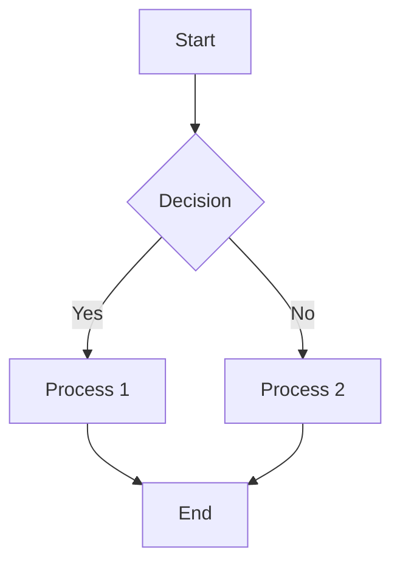
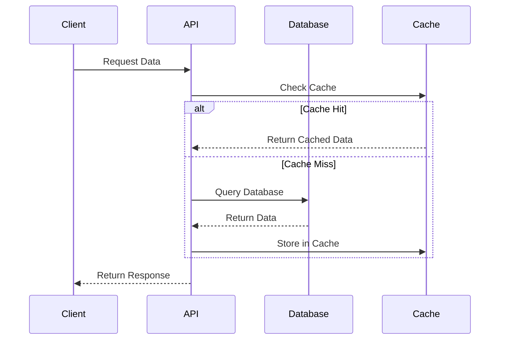
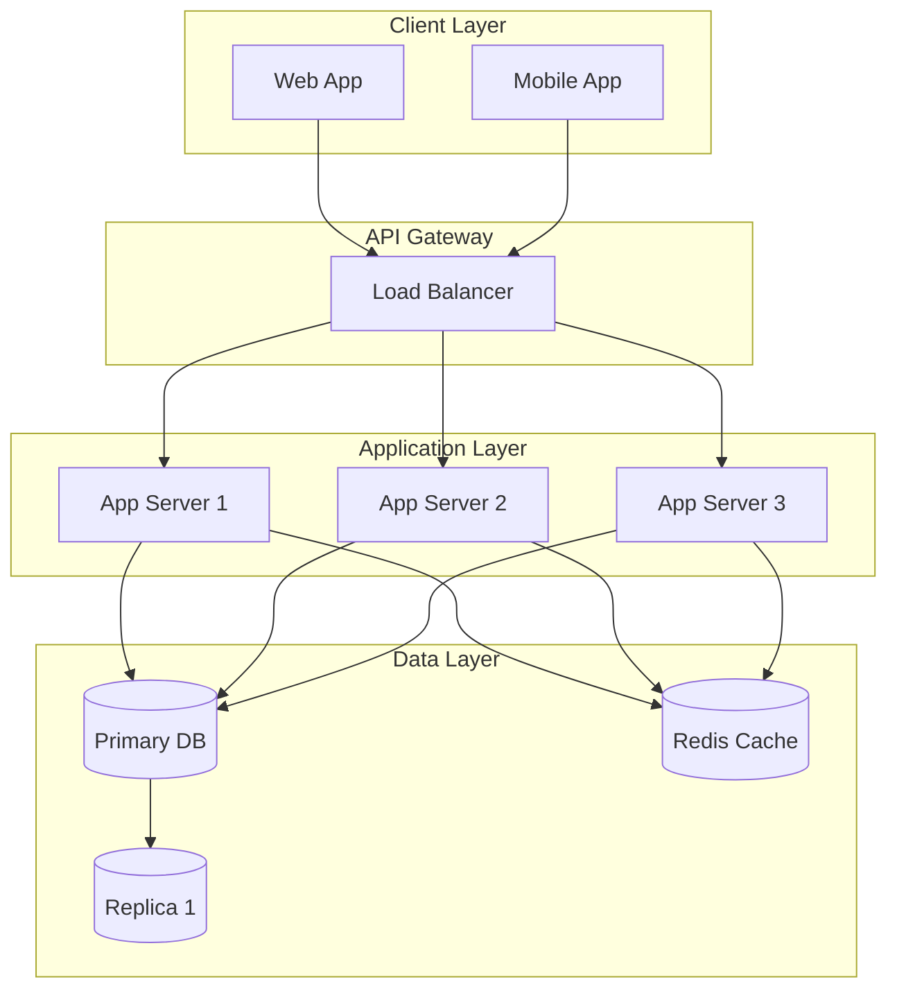
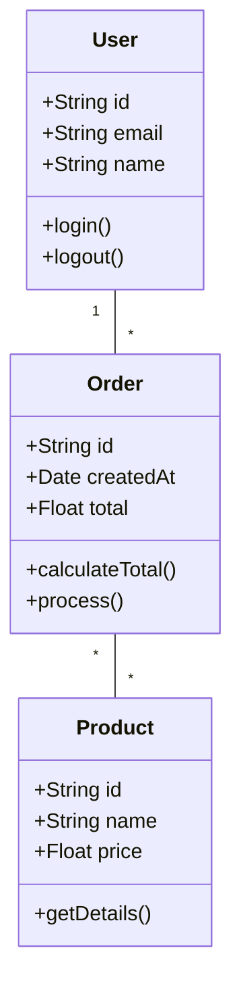
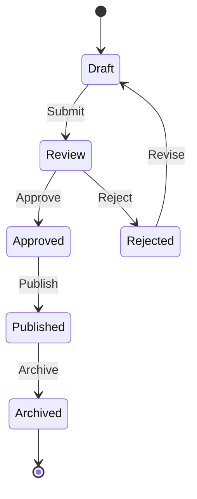
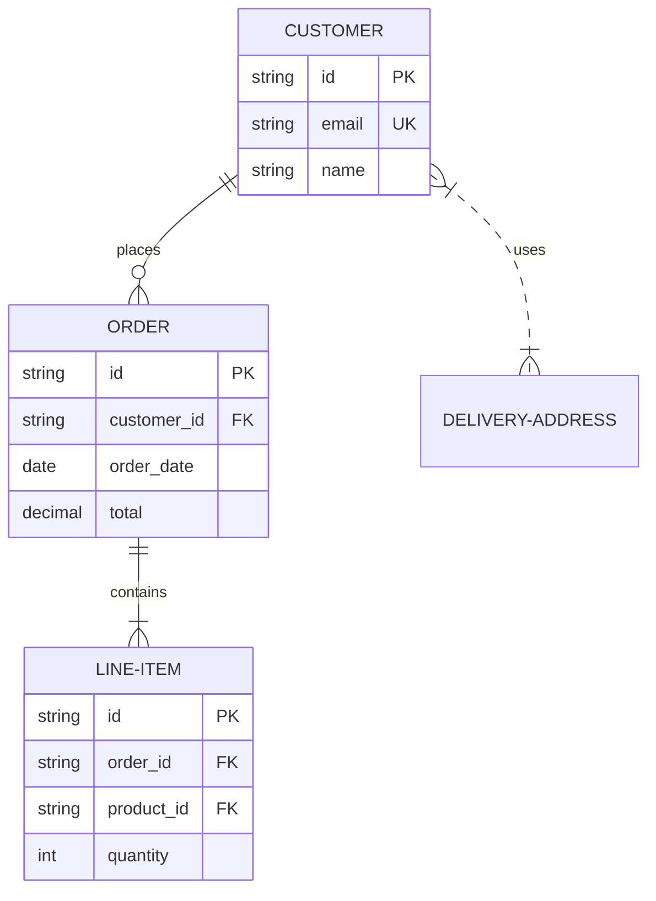

# Architecture Diagram Template

Use this template to include architecture diagrams and system design illustrations in interview questions.

## Mermaid Diagram Templates

### Flowchart Example



### Sequence Diagram Example



### System Architecture Example



### Class Diagram Example



### State Diagram Example



### Entity Relationship Diagram



## ASCII Diagram Template

```
┌─────────────────────────────────────────────────────────────┐
│                     [Component/System Name]                  │
└─────────────────────────────────────────────────────────────┘

┌──────────────┐          ┌──────────────┐          ┌──────────────┐
│   [Client]   │ ────────>│  [Service]   │ ────────>│  [Database]  │
│              │          │              │          │              │
│  [Details]   │<─────── │  [Details]   │<─────── │  [Details]   │
└──────────────┘          └──────────────┘          └──────────────┘
       │                         │                         │
       │                         │                         │
       v                         v                         v
┌──────────────┐          ┌──────────────┐          ┌──────────────┐
│   [Cache]    │          │   [Queue]    │          │  [Storage]   │
└──────────────┘          └──────────────┘          └──────────────┘
```

## Flow Diagram

```
[Start Event]
      │
      v
┌─────────────┐
│   Step 1    │
│ [Details]   │
└─────────────┘
      │
      v
   ╱     ╲
  ╱ Check? ╲ ───── No ────> [Alternative Path]
  \       /                       │
   ╲     ╱                        │
      │ Yes                       │
      v                           │
┌─────────────┐                   │
│   Step 2    │                   │
│ [Details]   │                   │
└─────────────┘                   │
      │                           │
      └───────────┬───────────────┘
                  v
            [End Event]
```

## System Architecture

```
                          ┌─────────────────────┐
                          │    Load Balancer    │
                          └──────────┬──────────┘
                                     │
                ┌────────────────────┼────────────────────┐
                │                    │                    │
                v                    v                    v
        ┌───────────────┐    ┌───────────────┐   ┌───────────────┐
        │  App Server 1 │    │  App Server 2 │   │  App Server 3 │
        └───────┬───────┘    └───────┬───────┘   └───────┬───────┘
                │                    │                    │
                └────────────────────┼────────────────────┘
                                     │
                    ┌────────────────┼────────────────┐
                    │                │                │
                    v                v                v
            ┌──────────────┐  ┌──────────────┐  ┌──────────────┐
            │    Cache      │  │   Database   │  │  Queue/Jobs  │
            │   (Redis)     │  │  (Primary)   │  │   (Redis)    │
            └──────────────┘  └───────┬──────┘  └──────────────┘
                                      │
                              ┌───────┴────────┐
                              │                │
                              v                v
                      ┌──────────────┐  ┌──────────────┐
                      │  DB Replica  │  │  DB Replica  │
                      │  (Read-only) │  │  (Read-only) │
                      └──────────────┘  └──────────────┘
```

## Sequence Diagram

```
Client          API Gateway         Service A         Service B        Database
  │                  │                  │                 │                │
  │─────Request─────>│                  │                 │                │
  │                  │                  │                 │                │
  │                  │────Validate─────>│                 │                │
  │                  │                  │                 │                │
  │                  │                  │─────Query──────>│                │
  │                  │                  │                 │                │
  │                  │                  │                 │────Read───────>│
  │                  │                  │                 │                │
  │                  │                  │                 │<────Data───────│
  │                  │                  │                 │                │
  │                  │                  │<────Result──────│                │
  │                  │                  │                 │                │
  │                  │<────Response─────│                 │                │
  │                  │                  │                 │                │
  │<────Response─────│                  │                 │                │
  │                  │                  │                 │                │
```

## Deployment Architecture

```
┌─────────────────────────────────────────────────────────────────┐
│                         Cloud Provider (AWS/GCP/Azure)          │
│                                                                  │
│  ┌─────────────────────────────────────────────────────────┐   │
│  │                    Kubernetes Cluster                    │   │
│  │                                                           │   │
│  │  ┌─────────────┐  ┌─────────────┐  ┌─────────────┐     │   │
│  │  │   Ingress   │  │   Ingress   │  │   Ingress   │     │   │
│  │  │ Controller  │  │ Controller  │  │ Controller  │     │   │
│  │  └──────┬──────┘  └──────┬──────┘  └──────┬──────┘     │   │
│  │         │                │                │             │   │
│  │  ┌──────┴──────────────────────────┴──────┴──────┐     │   │
│  │  │              Service Layer                     │     │   │
│  │  └──────┬───────────────────────────────┬────────┘     │   │
│  │         │                                │              │   │
│  │  ┌──────┴──────┐                 ┌──────┴──────┐       │   │
│  │  │    Pods     │                 │    Pods     │       │   │
│  │  │  (Backend)  │                 │  (Workers)  │       │   │
│  │  └─────────────┘                 └─────────────┘       │   │
│  └─────────────────────────────────────────────────────────┘   │
│                                                                  │
│  ┌──────────────┐  ┌──────────────┐  ┌──────────────┐         │
│  │   Database   │  │    Cache     │  │  Object      │         │
│  │   (RDS)      │  │  (ElastiC)   │  │  Storage     │         │
│  └──────────────┘  └──────────────┘  └──────────────┘         │
└─────────────────────────────────────────────────────────────────┘
```

## Data Flow Diagram

```
Input Data
    │
    v
┌─────────────────┐
│  Validation     │
│  Layer          │
└────────┬────────┘
         │
         v
┌─────────────────┐      ┌─────────────────┐
│  Processing     │─────>│  Cache Check    │
│  Layer          │      └────────┬────────┘
└────────┬────────┘               │
         │                     Hit │ Miss
         │                        │
         v                        v
┌─────────────────┐      ┌─────────────────┐
│  Business       │      │  Database       │
│  Logic          │      │  Query          │
└────────┬────────┘      └────────┬────────┘
         │                        │
         v                        v
┌─────────────────┐      ┌─────────────────┐
│  Data           │<─────│  Cache Update   │
│  Transformation │      └─────────────────┘
└────────┬────────┘
         │
         v
┌─────────────────┐
│  Response       │
│  Formatting     │
└────────┬────────┘
         │
         v
    Output Data
```

## Microservices Architecture

```
                    ┌─────────────────┐
                    │  API Gateway    │
                    └────────┬────────┘
                             │
        ┌────────────────────┼────────────────────┐
        │                    │                    │
        v                    v                    v
┌───────────────┐    ┌───────────────┐    ┌───────────────┐
│   Auth        │    │   User        │    │   Order       │
│   Service     │    │   Service     │    │   Service     │
└───────┬───────┘    └───────┬───────┘    └───────┬───────┘
        │                    │                    │
        v                    v                    v
┌───────────────┐    ┌───────────────┐    ┌───────────────┐
│   Auth DB     │    │   User DB     │    │   Order DB    │
└───────────────┘    └───────────────┘    └───────────────┘

                    ┌─────────────────┐
                    │  Message Queue  │
                    │    (RabbitMQ)   │
                    └─────────────────┘
                             │
        ┌────────────────────┼────────────────────┐
        v                    v                    v
┌───────────────┐    ┌───────────────┐    ┌───────────────┐
│  Notification │    │   Analytics   │    │   Logging     │
│   Service     │    │   Service     │    │   Service     │
└───────────────┘    └───────────────┘    └───────────────┘
```

## Component Interaction

```
┌────────────────────────────────────────────────────────┐
│                    Frontend Layer                      │
│  ┌──────────┐  ┌──────────┐  ┌──────────┐            │
│  │  React   │  │  Next.js │  │  Mobile  │            │
│  │   App    │  │   App    │  │   App    │            │
│  └────┬─────┘  └────┬─────┘  └────┬─────┘            │
└───────┼─────────────┼─────────────┼──────────────────┘
        │             │             │
        └─────────────┼─────────────┘
                      │
        ┌─────────────┴─────────────┐
        │      REST API / GraphQL    │
        └─────────────┬─────────────┘
                      │
┌─────────────────────┼─────────────────────────────────┐
│                Backend Layer                          │
│  ┌──────────────────┼──────────────────┐             │
│  │           Application Core           │             │
│  │  ┌──────────┐  ┌──────────┐         │             │
│  │  │  Domain  │  │ Business │         │             │
│  │  │  Logic   │  │   Rules  │         │             │
│  │  └──────────┘  └──────────┘         │             │
│  └──────────────────┬──────────────────┘             │
│                     │                                 │
│  ┌──────────────────┼──────────────────┐             │
│  │          Data Access Layer           │             │
│  │  ┌──────────┐  ┌──────────┐         │             │
│  │  │   ORM    │  │  Query   │         │             │
│  │  │ (Eloquent│  │ Builder  │         │             │
│  │  └──────────┘  └──────────┘         │             │
│  └──────────────────┬──────────────────┘             │
└────────────────────┼──────────────────────────────────┘
                     │
        ┌────────────┼────────────┐
        │            │            │
        v            v            v
┌──────────┐  ┌──────────┐  ┌──────────┐
│ Database │  │  Cache   │  │ External │
│          │  │  (Redis) │  │   APIs   │
└──────────┘  └──────────┘  └──────────┘
```

## Usage Instructions

1. Choose the appropriate diagram type for your question
2. Copy the template and customize it with your specific components
3. Use consistent naming conventions
4. Add labels and annotations to clarify complex interactions
5. Include a legend if using special symbols
6. Consider adding a text description below the diagram explaining key points

## Diagram Legend

```
Symbol Key:
───>   : Synchronous request/response
- - >  : Asynchronous message
═══>   : Data flow
│      : Connection/relationship
┌─┐    : Component/service
╱ ╲    : Decision point
```
