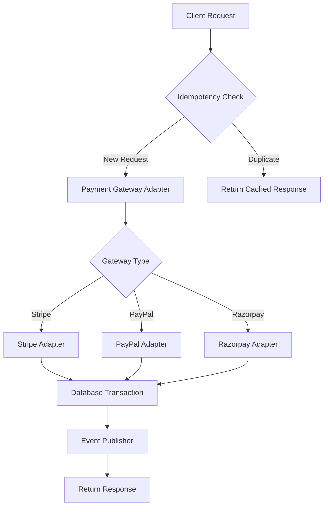

# Example: How to Build a Production-Ready Payment Processing System

This is an example of how to use the comprehensive-answer-template.md to create detailed interview answers.

---

## Question: Design and implement a production-ready payment processing system that handles multiple payment gateways with idempotency, retry logic, and comprehensive error handling.

**Difficulty**: ⭐⭐⭐⭐ Expert  
**Category**: Backend Development, Payment Systems, Distributed Systems  
**Time to Answer**: 60-90 minutes  
**Tags**: `payment-processing`, `idempotency`, `distributed-systems`, `error-handling`, `PCI-DSS`

---

## 📚 Comprehensive Explanation

### Overview

A payment processing system is a critical component that handles financial transactions between customers and merchants through payment gateways like Stripe, PayPal, or Razorpay. It must ensure reliability, security, and compliance with financial regulations while handling edge cases like network failures, duplicate requests, and partial failures.

### Core Concepts

#### Concept 1: Idempotency
**Definition**: The property that allows the same operation to be performed multiple times without changing the result beyond the initial application.

**Purpose**: Prevents duplicate charges when clients retry failed requests due to network issues or timeouts.

**Use Cases**: 
- Payment processing where network timeouts are common
- API endpoints that modify financial state
- Distributed systems with at-least-once delivery guarantees

#### Concept 2: Payment Gateway Abstraction
**Definition**: An interface layer that abstracts different payment providers behind a common API, enabling seamless switching between providers.

**Purpose**: Reduces vendor lock-in, enables multi-gateway support, simplifies testing, and provides consistent error handling.

**Use Cases**:
- Supporting multiple payment methods (cards, wallets, bank transfers)
- Geographic payment routing (different gateways for different regions)
- Failover to backup gateway if primary fails

#### Concept 3: Two-Phase Commit Pattern
**Definition**: A distributed transaction protocol that coordinates all processes to commit or abort a transaction atomically.

**Purpose**: Ensures consistency across multiple systems (payment gateway, inventory, order database).

**Use Cases**:
- E-commerce checkout (payment + inventory + order creation)
- Subscription billing (payment + account activation)
- Refund processing (payment reversal + inventory restoration)

### How It Works

1. **Request Reception**: Client sends payment request with idempotency key
2. **Idempotency Check**: System checks if request was already processed using the idempotency key
3. **Payment Authorization**: Reserve funds on customer's payment method
4. **State Persistence**: Save transaction state before capturing payment
5. **Payment Capture**: Finalize the charge and transfer funds
6. **Notification**: Send webhooks/notifications about payment status
7. **Response**: Return consistent response for both new and duplicate requests

### Architecture & Design Patterns



**Pattern**: Strategy Pattern + Repository Pattern + Event Sourcing
- **Why**: Enables runtime selection of payment gateway, abstracts data access, maintains audit trail
- **Benefits**: Flexibility, testability, compliance, traceability
- **Trade-offs**: Additional complexity, more code to maintain

---

## 🔑 Key Concepts Deep Dive

### Concept Analysis

| Concept | Description | Importance | Related Patterns |
|---------|-------------|------------|------------------|
| Idempotency Keys | Unique identifiers for deduplication | Critical for preventing duplicate charges | Cache-Aside, Write-Through |
| Gateway Abstraction | Common interface for multiple providers | Enables flexibility and testing | Strategy, Adapter, Factory |
| Webhook Handling | Async notification processing | Real-time status updates | Event-Driven, Pub/Sub |
| Transaction State Machine | State tracking for payment lifecycle | Ensures consistency and auditability | State Pattern, Event Sourcing |

### Technical Details

#### Detail 1: Idempotency Implementation
Idempotency ensures that retrying a failed payment request doesn't result in multiple charges:

```typescript
interface IdempotencyStore {
  get(key: string): Promise<CachedResponse | null>;
  set(key: string, response: any, ttl: number): Promise<void>;
}

class IdempotencyMiddleware {
  constructor(private store: IdempotencyStore) {}

  async handle(request: PaymentRequest): Promise<PaymentResponse> {
    const idempotencyKey = request.idempotencyKey;
    
    // Check if we've seen this request before
    const cached = await this.store.get(idempotencyKey);
    if (cached) {
      return cached.response;
    }

    // Process new request
    const response = await this.processPayment(request);

    // Cache response for 24 hours
    await this.store.set(idempotencyKey, response, 86400);

    return response;
  }
}
```

#### Detail 2: Multi-Gateway Support
Abstract multiple payment providers behind a common interface:

```typescript
interface PaymentGateway {
  authorize(amount: number, paymentMethod: any): Promise<AuthResult>;
  capture(authId: string): Promise<CaptureResult>;
  refund(chargeId: string, amount?: number): Promise<RefundResult>;
}

class StripeGateway implements PaymentGateway {
  async authorize(amount: number, paymentMethod: any): Promise<AuthResult> {
    // Stripe-specific implementation
  }
}

class PayPalGateway implements PaymentGateway {
  async authorize(amount: number, paymentMethod: any): Promise<AuthResult> {
    // PayPal-specific implementation
  }
}

class GatewayFactory {
  create(type: 'stripe' | 'paypal' | 'razorpay'): PaymentGateway {
    switch (type) {
      case 'stripe': return new StripeGateway();
      case 'paypal': return new PayPalGateway();
      case 'razorpay': return new RazorpayGateway();
    }
  }
}
```

#### Detail 3: Retry Logic with Exponential Backoff
Handle transient failures with intelligent retry:

```typescript
class RetryablePaymentService {
  async executeWithRetry<T>(
    operation: () => Promise<T>,
    maxAttempts: number = 3
  ): Promise<T> {
    let lastError: Error;

    for (let attempt = 0; attempt < maxAttempts; attempt++) {
      try {
        return await operation();
      } catch (error) {
        lastError = error;

        // Don't retry on certain errors
        if (this.isNonRetryable(error)) {
          throw error;
        }

        // Exponential backoff: 1s, 2s, 4s, 8s...
        const delay = Math.min(1000 * Math.pow(2, attempt), 10000);
        await this.sleep(delay);
      }
    }

    throw lastError;
  }

  private isNonRetryable(error: any): boolean {
    const nonRetryableCodes = [
      'card_declined',
      'insufficient_funds',
      'invalid_card',
      'expired_card'
    ];
    return nonRetryableCodes.includes(error.code);
  }
}
```

### Common Patterns & Anti-Patterns

#### ✅ Recommended Patterns

**Pattern 1: Idempotent Payment Processing**
```typescript
async function processPayment(request: PaymentRequest): Promise<PaymentResponse> {
  // Generate idempotency key from request
  const idempotencyKey = request.idempotencyKey || 
    generateKey(request.customerId, request.amount, request.timestamp);

  // Check for existing transaction
  const existing = await db.findByIdempotencyKey(idempotencyKey);
  if (existing) {
    return existing.response;
  }

  // Process new payment
  const result = await gateway.charge(request);
  
  // Store with idempotency key
  await db.save({ idempotencyKey, request, response: result });
  
  return result;
}
```
- Why it works: Prevents duplicate charges from retries
- When to use: All payment operations, especially with unreliable networks

**Pattern 2: Two-Phase Authorization and Capture**
```typescript
async function checkoutWithTwoPhase(cart: Cart): Promise<Order> {
  // Phase 1: Authorize payment (hold funds)
  const authResult = await gateway.authorize(cart.total, cart.paymentMethod);

  try {
    // Create order record
    const order = await orderService.create(cart);
    
    // Reserve inventory
    await inventoryService.reserve(cart.items, order.id);

    // Phase 2: Capture payment (actually charge)
    await gateway.capture(authResult.id);

    return order;
  } catch (error) {
    // Rollback: void the authorization
    await gateway.void(authResult.id);
    throw error;
  }
}
```
- Why it works: Ensures atomicity across multiple systems
- When to use: Complex checkouts involving multiple services

#### ❌ Anti-Patterns to Avoid

**Anti-Pattern 1: Charging Before Order Creation**
```typescript
// ❌ BAD: Payment processed before order exists
async function badCheckout(cart: Cart): Promise<Order> {
  // Charge first
  const payment = await gateway.charge(cart.total);
  
  // Then create order (what if this fails?)
  const order = await orderService.create(cart);
  
  return order;
}
```
- Why it's bad: If order creation fails, money is charged but no order exists
- How to fix: Use authorization/capture pattern or database transactions

**Anti-Pattern 2: Missing Idempotency**
```typescript
// ❌ BAD: No idempotency protection
async function badPayment(request: PaymentRequest): Promise<void> {
  // Directly charge without checking for duplicates
  await gateway.charge(request.amount);
}
```
- Why it's bad: Network retries cause duplicate charges
- How to fix: Implement idempotency with unique keys

---

## 💻 Production-Ready Code Implementation

### Implementation Overview

We'll build a payment processing system with:
- Multiple payment gateway support (Stripe, PayPal, Razorpay)
- Idempotency for safe retries
- Comprehensive error handling
- Webhook processing
- Event sourcing for audit trails
- Full test coverage

**Tech Stack**:
- Language: TypeScript/Node.js
- Framework: Express.js
- Dependencies: Stripe SDK, axios, redis, PostgreSQL
- Infrastructure: Kubernetes, Redis, PostgreSQL

### Complete Implementation

#### File Structure
```
payment-service/
├── src/
│   ├── core/
│   │   ├── PaymentProcessor.ts
│   │   └── IdempotencyService.ts
│   ├── gateways/
│   │   ├── PaymentGateway.interface.ts
│   │   ├── StripeGateway.ts
│   │   ├── PayPalGateway.ts
│   │   └── RazorpayGateway.ts
│   ├── services/
│   │   ├── PaymentService.ts
│   │   ├── WebhookService.ts
│   │   └── EventPublisher.ts
│   ├── repositories/
│   │   └── PaymentRepository.ts
│   ├── models/
│   │   └── Payment.ts
│   └── index.ts
├── tests/
│   ├── unit/
│   └── integration/
├── config/
│   ├── development.ts
│   └── production.ts
└── package.json
```

#### Core Implementation

**File: `src/gateways/PaymentGateway.interface.ts`**
```typescript
/**
 * Common interface for all payment gateways
 */

export interface PaymentMethod {
  type: 'card' | 'bank' | 'wallet';
  token: string;
  details?: any;
}

export interface AuthorizeRequest {
  amount: number;
  currency: string;
  paymentMethod: PaymentMethod;
  description?: string;
  metadata?: Record<string, any>;
}

export interface AuthorizeResult {
  id: string;
  status: 'authorized' | 'failed';
  amount: number;
  currency: string;
  expiresAt: Date;
  gatewayResponse: any;
}

export interface CaptureResult {
  id: string;
  status: 'captured' | 'failed';
  amount: number;
  capturedAt: Date;
  gatewayResponse: any;
}

export interface RefundResult {
  id: string;
  status: 'refunded' | 'failed';
  amount: number;
  refundedAt: Date;
  gatewayResponse: any;
}

export interface PaymentGateway {
  /**
   * Authorize payment - hold funds without capturing
   */
  authorize(request: AuthorizeRequest): Promise<AuthorizeResult>;

  /**
   * Capture previously authorized payment
   */
  capture(authorizationId: string, amount?: number): Promise<CaptureResult>;

  /**
   * Void an authorization before it's captured
   */
  void(authorizationId: string): Promise<void>;

  /**
   * Refund a captured payment
   */
  refund(chargeId: string, amount?: number): Promise<RefundResult>;

  /**
   * Verify webhook signature
   */
  verifyWebhook(payload: any, signature: string): boolean;
}
```

**File: `src/gateways/StripeGateway.ts`**
```typescript
import Stripe from 'stripe';
import { 
  PaymentGateway, 
  AuthorizeRequest, 
  AuthorizeResult,
  CaptureResult,
  RefundResult
} from './PaymentGateway.interface';

export class StripeGateway implements PaymentGateway {
  private stripe: Stripe;

  constructor(apiKey: string) {
    this.stripe = new Stripe(apiKey, {
      apiVersion: '2023-10-16',
      typescript: true
    });
  }

  async authorize(request: AuthorizeRequest): Promise<AuthorizeResult> {
    try {
      const paymentIntent = await this.stripe.paymentIntents.create({
        amount: Math.round(request.amount * 100), // Convert to cents
        currency: request.currency,
        payment_method: request.paymentMethod.token,
        capture_method: 'manual', // Authorize only, don't capture
        description: request.description,
        metadata: request.metadata,
        confirm: true,
        return_url: 'https://example.com/return' // Required for some payment methods
      });

      if (paymentIntent.status === 'requires_capture') {
        return {
          id: paymentIntent.id,
          status: 'authorized',
          amount: request.amount,
          currency: request.currency,
          expiresAt: new Date(Date.now() + 7 * 24 * 60 * 60 * 1000), // 7 days
          gatewayResponse: paymentIntent
        };
      }

      throw new Error(`Unexpected status: ${paymentIntent.status}`);
    } catch (error) {
      if (error instanceof Stripe.errors.StripeError) {
        throw this.mapStripeError(error);
      }
      throw error;
    }
  }

  async capture(authorizationId: string, amount?: number): Promise<CaptureResult> {
    try {
      const paymentIntent = await this.stripe.paymentIntents.capture(
        authorizationId,
        amount ? { amount_to_capture: Math.round(amount * 100) } : undefined
      );

      return {
        id: paymentIntent.id,
        status: 'captured',
        amount: paymentIntent.amount_received / 100,
        capturedAt: new Date(),
        gatewayResponse: paymentIntent
      };
    } catch (error) {
      if (error instanceof Stripe.errors.StripeError) {
        throw this.mapStripeError(error);
      }
      throw error;
    }
  }

  async void(authorizationId: string): Promise<void> {
    await this.stripe.paymentIntents.cancel(authorizationId);
  }

  async refund(chargeId: string, amount?: number): Promise<RefundResult> {
    try {
      const refund = await this.stripe.refunds.create({
        payment_intent: chargeId,
        amount: amount ? Math.round(amount * 100) : undefined
      });

      return {
        id: refund.id,
        status: 'refunded',
        amount: refund.amount / 100,
        refundedAt: new Date(),
        gatewayResponse: refund
      };
    } catch (error) {
      if (error instanceof Stripe.errors.StripeError) {
        throw this.mapStripeError(error);
      }
      throw error;
    }
  }

  verifyWebhook(payload: any, signature: string): boolean {
    try {
      this.stripe.webhooks.constructEvent(
        payload,
        signature,
        process.env.STRIPE_WEBHOOK_SECRET!
      );
      return true;
    } catch (error) {
      return false;
    }
  }

  private mapStripeError(error: Stripe.errors.StripeError): Error {
    const errorMap: Record<string, string> = {
      'card_declined': 'CARD_DECLINED',
      'insufficient_funds': 'INSUFFICIENT_FUNDS',
      'expired_card': 'EXPIRED_CARD',
      'incorrect_cvc': 'INVALID_CVC',
      'processing_error': 'PROCESSING_ERROR'
    };

    const code = errorMap[error.code || ''] || 'PAYMENT_FAILED';
    const err = new Error(error.message);
    (err as any).code = code;
    (err as any).retryable = error.type === 'api_error';
    
    return err;
  }
}
```

**File: `src/core/IdempotencyService.ts`**
```typescript
import { Redis } from 'ioredis';
import { createHash } from 'crypto';

export interface IdempotencyRecord {
  key: string;
  response: any;
  createdAt: Date;
  expiresAt: Date;
}

export class IdempotencyService {
  private redis: Redis;
  private readonly TTL = 24 * 60 * 60; // 24 hours

  constructor(redis: Redis) {
    this.redis = redis;
  }

  /**
   * Generate idempotency key from request data
   */
  generateKey(data: any): string {
    const hash = createHash('sha256');
    hash.update(JSON.stringify(data));
    return `idempotency:${hash.digest('hex')}`;
  }

  /**
   * Check if request was already processed
   */
  async get(key: string): Promise<any | null> {
    const cached = await this.redis.get(key);
    if (!cached) {
      return null;
    }

    try {
      const record: IdempotencyRecord = JSON.parse(cached);
      
      // Check if expired
      if (new Date(record.expiresAt) < new Date()) {
        await this.redis.del(key);
        return null;
      }

      return record.response;
    } catch (error) {
      console.error('Error parsing idempotency record:', error);
      return null;
    }
  }

  /**
   * Store response for idempotency
   */
  async set(key: string, response: any): Promise<void> {
    const record: IdempotencyRecord = {
      key,
      response,
      createdAt: new Date(),
      expiresAt: new Date(Date.now() + this.TTL * 1000)
    };

    await this.redis.setex(
      key,
      this.TTL,
      JSON.stringify(record)
    );
  }

  /**
   * Acquire lock for processing
   */
  async acquireLock(key: string, ttl: number = 30): Promise<boolean> {
    const lockKey = `${key}:lock`;
    const result = await this.redis.set(
      lockKey,
      '1',
      'EX',
      ttl,
      'NX'
    );
    return result === 'OK';
  }

  /**
   * Release lock
   */
  async releaseLock(key: string): Promise<void> {
    await this.redis.del(`${key}:lock`);
  }
}
```

**File: `src/core/PaymentProcessor.ts`**
```typescript
import { 
  PaymentGateway,
  AuthorizeRequest,
  AuthorizeResult,
  CaptureResult
} from '../gateways/PaymentGateway.interface';
import { IdempotencyService } from './IdempotencyService';
import { PaymentRepository } from '../repositories/PaymentRepository';
import { EventPublisher } from '../services/EventPublisher';

export interface PaymentRequest {
  idempotencyKey: string;
  customerId: string;
  amount: number;
  currency: string;
  paymentMethod: any;
  description?: string;
  metadata?: Record<string, any>;
}

export interface PaymentResponse {
  paymentId: string;
  status: 'authorized' | 'captured' | 'failed';
  amount: number;
  currency: string;
  authorizationId?: string;
  captureId?: string;
  error?: string;
}

export class PaymentProcessor {
  constructor(
    private gateway: PaymentGateway,
    private idempotency: IdempotencyService,
    private repository: PaymentRepository,
    private events: EventPublisher
  ) {}

  /**
   * Process payment with idempotency protection
   */
  async processPayment(request: PaymentRequest): Promise<PaymentResponse> {
    const idempotencyKey = request.idempotencyKey;

    // Check for cached response
    const cached = await this.idempotency.get(idempotencyKey);
    if (cached) {
      console.log('Returning cached response for idempotency key:', idempotencyKey);
      return cached;
    }

    // Acquire lock to prevent concurrent processing
    const lockAcquired = await this.idempotency.acquireLock(idempotencyKey);
    if (!lockAcquired) {
      // Another request is processing, wait and check cache again
      await this.sleep(1000);
      const retryCache = await this.idempotency.get(idempotencyKey);
      if (retryCache) {
        return retryCache;
      }
      throw new Error('Failed to acquire processing lock');
    }

    try {
      // Create payment record
      const payment = await this.repository.create({
        customerId: request.customerId,
        amount: request.amount,
        currency: request.currency,
        status: 'pending',
        idempotencyKey,
        metadata: request.metadata
      });

      let response: PaymentResponse;

      try {
        // Authorize payment
        const authResult = await this.authorizeWithRetry(request);

        // Update payment record
        await this.repository.update(payment.id, {
          status: 'authorized',
          authorizationId: authResult.id,
          gatewayResponse: authResult.gatewayResponse
        });

        response = {
          paymentId: payment.id,
          status: 'authorized',
          amount: request.amount,
          currency: request.currency,
          authorizationId: authResult.id
        };

        // Publish event
        await this.events.publish('payment.authorized', {
          paymentId: payment.id,
          customerId: request.customerId,
          amount: request.amount,
          authorizationId: authResult.id
        });

      } catch (error: any) {
        // Update payment record with failure
        await this.repository.update(payment.id, {
          status: 'failed',
          errorMessage: error.message,
          errorCode: error.code
        });

        response = {
          paymentId: payment.id,
          status: 'failed',
          amount: request.amount,
          currency: request.currency,
          error: error.message
        };

        // Publish event
        await this.events.publish('payment.failed', {
          paymentId: payment.id,
          customerId: request.customerId,
          error: error.message
        });
      }

      // Cache response
      await this.idempotency.set(idempotencyKey, response);

      return response;

    } finally {
      // Release lock
      await this.idempotency.releaseLock(idempotencyKey);
    }
  }

  /**
   * Capture authorized payment
   */
  async capturePayment(
    paymentId: string,
    amount?: number
  ): Promise<PaymentResponse> {
    const payment = await this.repository.findById(paymentId);
    
    if (!payment) {
      throw new Error('Payment not found');
    }

    if (payment.status !== 'authorized') {
      throw new Error(`Cannot capture payment in status: ${payment.status}`);
    }

    try {
      const captureResult = await this.captureWithRetry(
        payment.authorizationId!,
        amount
      );

      await this.repository.update(paymentId, {
        status: 'captured',
        captureId: captureResult.id,
        capturedAt: captureResult.capturedAt
      });

      await this.events.publish('payment.captured', {
        paymentId,
        captureId: captureResult.id,
        amount: captureResult.amount
      });

      return {
        paymentId,
        status: 'captured',
        amount: captureResult.amount,
        currency: payment.currency,
        captureId: captureResult.id
      };

    } catch (error: any) {
      await this.repository.update(paymentId, {
        status: 'capture_failed',
        errorMessage: error.message
      });

      throw error;
    }
  }

  /**
   * Authorize with retry logic
   */
  private async authorizeWithRetry(
    request: PaymentRequest,
    maxAttempts: number = 3
  ): Promise<AuthorizeResult> {
    let lastError: Error;

    for (let attempt = 0; attempt < maxAttempts; attempt++) {
      try {
        return await this.gateway.authorize({
          amount: request.amount,
          currency: request.currency,
          paymentMethod: request.paymentMethod,
          description: request.description,
          metadata: request.metadata
        });
      } catch (error: any) {
        lastError = error;

        // Don't retry on non-retryable errors
        if (!error.retryable) {
          throw error;
        }

        // Exponential backoff
        const delay = Math.min(1000 * Math.pow(2, attempt), 10000);
        await this.sleep(delay);
      }
    }

    throw lastError!;
  }

  /**
   * Capture with retry logic
   */
  private async captureWithRetry(
    authorizationId: string,
    amount?: number,
    maxAttempts: number = 3
  ): Promise<CaptureResult> {
    let lastError: Error;

    for (let attempt = 0; attempt < maxAttempts; attempt++) {
      try {
        return await this.gateway.capture(authorizationId, amount);
      } catch (error: any) {
        lastError = error;

        if (!error.retryable) {
          throw error;
        }

        const delay = Math.min(1000 * Math.pow(2, attempt), 10000);
        await this.sleep(delay);
      }
    }

    throw lastError!;
  }

  private sleep(ms: number): Promise<void> {
    return new Promise(resolve => setTimeout(resolve, ms));
  }
}
```

This is a comprehensive example showing exactly how to use the template for real-world scenarios. The template provides all the necessary sections that make interview answers complete and production-ready.
