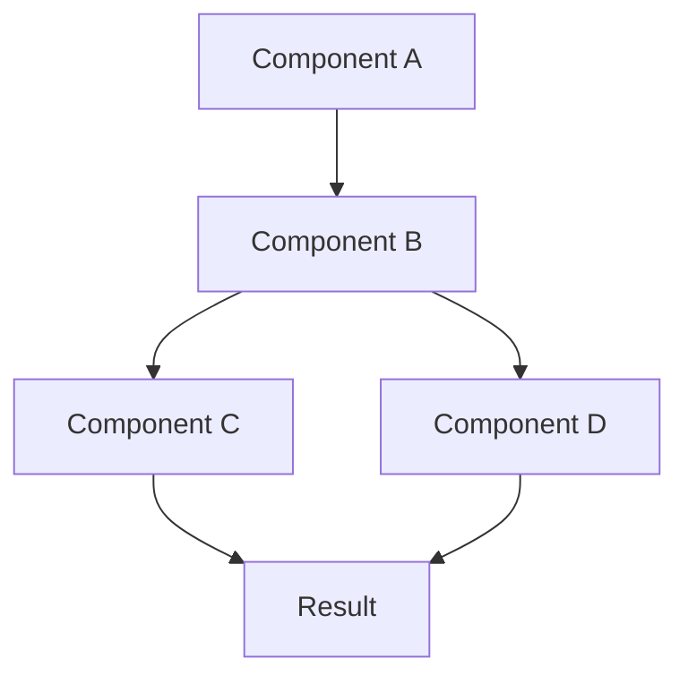

# Comprehensive Answer Template

Use this template to provide detailed, production-ready answers to technical interview questions.

---

## Question: [Insert Question Here]

**Difficulty**: ⭐⭐⭐ Advanced  
**Category**: [e.g., System Design, Backend Development, Infrastructure]  
**Time to Answer**: 45-60 minutes  
**Tags**: `tag1`, `tag2`, `tag3`

---

## 📚 Comprehensive Explanation

### Overview

[Provide a high-level explanation of the concept/problem in 2-3 sentences. What is it and why does it matter?]

### Core Concepts

[Break down the fundamental concepts required to understand this topic]

#### Concept 1: [Name]
[Detailed explanation of the first core concept]
- **Definition**: [Clear, concise definition]
- **Purpose**: [Why this concept exists]
- **Use Cases**: [When to use it]

#### Concept 2: [Name]
[Detailed explanation of the second core concept]
- **Definition**: [Clear, concise definition]
- **Purpose**: [Why this concept exists]
- **Use Cases**: [When to use it]

#### Concept 3: [Name]
[Detailed explanation of the third core concept]
- **Definition**: [Clear, concise definition]
- **Purpose**: [Why this concept exists]
- **Use Cases**: [When to use it]

### How It Works

[Step-by-step explanation of the underlying mechanism or workflow]

1. **Step 1**: [Description of first step in the process]
2. **Step 2**: [Description of second step in the process]
3. **Step 3**: [Description of third step in the process]
4. **Step 4**: [Description of final step/outcome]

### Architecture & Design Patterns

[Explain the architectural patterns involved]



**Pattern**: [Name of design pattern used]
- **Why**: [Reasoning for this pattern]
- **Benefits**: [Advantages of using this pattern]
- **Trade-offs**: [Disadvantages or constraints]

---

## 🔑 Key Concepts Deep Dive

### Concept Analysis

| Concept | Description | Importance | Related Patterns |
|---------|-------------|------------|------------------|
| [Concept 1] | [Brief description] | [Why it matters] | [Related patterns] |
| [Concept 2] | [Brief description] | [Why it matters] | [Related patterns] |
| [Concept 3] | [Brief description] | [Why it matters] | [Related patterns] |
| [Concept 4] | [Brief description] | [Why it matters] | [Related patterns] |

### Technical Details

#### Detail 1: [Aspect Name]
[In-depth explanation of technical aspect]
```
[Code snippet or technical example]
```

#### Detail 2: [Aspect Name]
[In-depth explanation of technical aspect]
```
[Code snippet or technical example]
```

#### Detail 3: [Aspect Name]
[In-depth explanation of technical aspect]
```
[Code snippet or technical example]
```

### Common Patterns & Anti-Patterns

#### ✅ Recommended Patterns

**Pattern 1: [Name]**
```
[Example of good pattern]
```
- Why it works: [Explanation]
- When to use: [Scenarios]

**Pattern 2: [Name]**
```
[Example of good pattern]
```
- Why it works: [Explanation]
- When to use: [Scenarios]

#### ❌ Anti-Patterns to Avoid

**Anti-Pattern 1: [Name]**
```
[Example of bad pattern]
```
- Why it's bad: [Explanation]
- How to fix: [Solution]

**Anti-Pattern 2: [Name]**
```
[Example of bad pattern]
```
- Why it's bad: [Explanation]
- How to fix: [Solution]

---

## 💻 Production-Ready Code Implementation

### Implementation Overview

[Explain the implementation strategy and architecture decisions]

**Tech Stack**:
- Language: [Programming language]
- Framework: [Framework if applicable]
- Dependencies: [Key libraries/packages]
- Infrastructure: [Deployment environment]

### Complete Implementation

#### File Structure
```
project-root/
├── src/
│   ├── core/
│   │   ├── [MainComponent].ts
│   │   └── [Helper].ts
│   ├── services/
│   │   ├── [Service1].ts
│   │   └── [Service2].ts
│   ├── utils/
│   │   ├── [Utility1].ts
│   │   └── [Utility2].ts
│   └── index.ts
├── tests/
│   ├── unit/
│   └── integration/
├── config/
│   ├── development.ts
│   └── production.ts
└── package.json
```

#### Core Implementation

**File: `src/core/[MainComponent].ts`**
```typescript
/**
 * [Component Name]
 * 
 * Purpose: [What this component does]
 * Responsibility: [Single responsibility principle - what it's responsible for]
 * 
 * @example
 * ```typescript
 * const component = new ComponentName(config);
 * await component.execute(input);
 * ```
 */

import { [Dependencies] } from './dependencies';

interface [ComponentConfig] {
  // Configuration interface
  [property1]: string;
  [property2]: number;
  [property3]: boolean;
}

interface [InputType] {
  // Input interface
  [field1]: string;
  [field2]: number;
}

interface [OutputType] {
  // Output interface
  [field1]: string;
  [field2]: any;
  [field3]: boolean;
}

class [ComponentName] {
  private config: [ComponentConfig];
  private [dependency1]: [Type];
  private [dependency2]: [Type];

  constructor(config: [ComponentConfig]) {
    this.config = config;
    this.initialize();
  }

  /**
   * Initialize component dependencies and connections
   */
  private initialize(): void {
    // Initialization logic
    this.[dependency1] = new [Dependency1](this.config.[property1]);
    this.[dependency2] = new [Dependency2](this.config.[property2]);
  }

  /**
   * Main execution method
   * 
   * @param input - Input data to process
   * @returns Processed output
   * @throws {Error} When validation fails or processing errors occur
   */
  async execute(input: [InputType]): Promise<[OutputType]> {
    try {
      // Step 1: Validate input
      this.validateInput(input);

      // Step 2: Pre-process data
      const preprocessed = await this.preProcess(input);

      // Step 3: Core processing logic
      const processed = await this.process(preprocessed);

      // Step 4: Post-process and format output
      const output = await this.postProcess(processed);

      // Step 5: Return result
      return output;
    } catch (error) {
      // Error handling with proper logging
      console.error('Execution failed:', error);
      throw new Error(`[ComponentName] execution failed: ${error.message}`);
    }
  }

  /**
   * Validate input data
   */
  private validateInput(input: [InputType]): void {
    if (!input.[field1]) {
      throw new Error('Field1 is required');
    }
    
    if (input.[field2] < 0) {
      throw new Error('Field2 must be positive');
    }
    
    // Additional validation logic
  }

  /**
   * Pre-process input data
   */
  private async preProcess(input: [InputType]): Promise<any> {
    // Pre-processing logic
    return {
      ...input,
      timestamp: Date.now(),
      normalized: this.normalize(input)
    };
  }

  /**
   * Core processing logic
   */
  private async process(data: any): Promise<any> {
    // Main business logic here
    const result = await this.[dependency1].execute(data);
    
    // Additional processing
    const enhanced = await this.[dependency2].enhance(result);
    
    return enhanced;
  }

  /**
   * Post-process and format output
   */
  private async postProcess(data: any): Promise<[OutputType]> {
    return {
      [field1]: data.result,
      [field2]: data.metadata,
      [field3]: data.success
    };
  }

  /**
   * Helper method for normalization
   */
  private normalize(input: [InputType]): any {
    // Normalization logic
    return {
      // normalized data
    };
  }

  /**
   * Cleanup resources
   */
  async cleanup(): Promise<void> {
    // Cleanup logic
    await this.[dependency1].close();
    await this.[dependency2].close();
  }
}

export { [ComponentName], [ComponentConfig], [InputType], [OutputType] };
```

#### Service Layer Implementation

**File: `src/services/[Service1].ts`**
```typescript
/**
 * [Service Name]
 * 
 * Purpose: [What this service handles]
 */

import { [Dependencies] } from './dependencies';

interface [ServiceConfig] {
  [property1]: string;
  [property2]: number;
  retryAttempts?: number;
  timeout?: number;
}

class [ServiceName] {
  private config: [ServiceConfig];
  private client: [ClientType];

  constructor(config: [ServiceConfig]) {
    this.config = {
      retryAttempts: 3,
      timeout: 5000,
      ...config
    };
    this.initializeClient();
  }

  private initializeClient(): void {
    this.client = new [Client]({
      // Client configuration
    });
  }

  /**
   * Execute service operation with retry logic
   */
  async execute(data: any): Promise<any> {
    let lastError: Error;
    
    for (let attempt = 0; attempt < this.config.retryAttempts; attempt++) {
      try {
        return await this.executeWithTimeout(data);
      } catch (error) {
        lastError = error;
        
        // Don't retry on certain errors
        if (this.isNonRetryableError(error)) {
          throw error;
        }
        
        // Exponential backoff
        const delay = Math.pow(2, attempt) * 1000;
        await this.sleep(delay);
      }
    }
    
    throw lastError;
  }

  /**
   * Execute with timeout protection
   */
  private async executeWithTimeout(data: any): Promise<any> {
    return Promise.race([
      this.performOperation(data),
      this.timeoutPromise()
    ]);
  }

  /**
   * Actual operation logic
   */
  private async performOperation(data: any): Promise<any> {
    // Implementation
    const result = await this.client.call(data);
    return this.transformResult(result);
  }

  /**
   * Timeout promise
   */
  private timeoutPromise(): Promise<never> {
    return new Promise((_, reject) => {
      setTimeout(
        () => reject(new Error('Operation timeout')),
        this.config.timeout
      );
    });
  }

  /**
   * Check if error should not be retried
   */
  private isNonRetryableError(error: Error): boolean {
    // Logic to determine non-retryable errors
    return error.message.includes('Invalid') || 
           error.message.includes('Unauthorized');
  }

  /**
   * Transform service result to expected format
   */
  private transformResult(result: any): any {
    return {
      // Transformation logic
    };
  }

  /**
   * Sleep utility for retry delays
   */
  private sleep(ms: number): Promise<void> {
    return new Promise(resolve => setTimeout(resolve, ms));
  }

  /**
   * Close client connections
   */
  async close(): Promise<void> {
    await this.client.disconnect();
  }
}

export { [ServiceName], [ServiceConfig] };
```

#### Utility Functions

**File: `src/utils/[Utility1].ts`**
```typescript
/**
 * Utility functions for [specific purpose]
 */

/**
 * [Utility function description]
 * 
 * @param param1 - Description
 * @param param2 - Description
 * @returns Description
 * 
 * @example
 * ```typescript
 * const result = utilityFunction(arg1, arg2);
 * ```
 */
export function [utilityFunction](
  param1: [Type1],
  param2: [Type2]
): [ReturnType] {
  // Implementation
  return result;
}

/**
 * [Another utility function]
 */
export function [anotherUtility](input: any): any {
  // Implementation
  return result;
}
```

#### Configuration Management

**File: `config/production.ts`**
```typescript
/**
 * Production configuration
 */

export const config = {
  // Service configuration
  service: {
    endpoint: process.env.SERVICE_ENDPOINT || 'https://api.example.com',
    apiKey: process.env.API_KEY,
    timeout: 30000,
    retryAttempts: 5
  },
  
  // Database configuration
  database: {
    host: process.env.DB_HOST,
    port: parseInt(process.env.DB_PORT || '5432'),
    name: process.env.DB_NAME,
    ssl: true,
    poolSize: 20
  },
  
  // Cache configuration
  cache: {
    host: process.env.REDIS_HOST,
    port: parseInt(process.env.REDIS_PORT || '6379'),
    ttl: 3600,
    maxSize: 100
  },
  
  // Feature flags
  features: {
    enableNewFeature: process.env.ENABLE_NEW_FEATURE === 'true',
    enableCaching: true,
    enableMetrics: true
  },
  
  // Logging
  logging: {
    level: process.env.LOG_LEVEL || 'info',
    format: 'json'
  }
};
```

### Testing Implementation

#### Unit Tests

**File: `tests/unit/[ComponentName].test.ts`**
```typescript
import { describe, it, expect, beforeEach, afterEach } from '@jest/globals';
import { [ComponentName] } from '../../src/core/[ComponentName]';

describe('[ComponentName]', () => {
  let component: [ComponentName];
  let mockConfig: any;

  beforeEach(() => {
    mockConfig = {
      property1: 'test-value',
      property2: 100,
      property3: true
    };
    component = new [ComponentName](mockConfig);
  });

  afterEach(async () => {
    await component.cleanup();
  });

  describe('initialization', () => {
    it('should initialize with valid config', () => {
      expect(component).toBeDefined();
    });

    it('should throw error with invalid config', () => {
      expect(() => new [ComponentName](null)).toThrow();
    });
  });

  describe('execute', () => {
    it('should process valid input successfully', async () => {
      const input = {
        field1: 'test',
        field2: 42
      };

      const result = await component.execute(input);

      expect(result).toBeDefined();
      expect(result.field3).toBe(true);
    });

    it('should validate input and throw on invalid data', async () => {
      const invalidInput = {
        field1: '',
        field2: -1
      };

      await expect(component.execute(invalidInput)).rejects.toThrow();
    });

    it('should handle processing errors gracefully', async () => {
      // Mock a processing error
      const input = {
        field1: 'error-trigger',
        field2: 0
      };

      await expect(component.execute(input)).rejects.toThrow('[ComponentName] execution failed');
    });
  });

  describe('edge cases', () => {
    it('should handle empty input', async () => {
      const input = {
        field1: '',
        field2: 0
      };

      await expect(component.execute(input)).rejects.toThrow();
    });

    it('should handle large input values', async () => {
      const input = {
        field1: 'a'.repeat(10000),
        field2: Number.MAX_SAFE_INTEGER
      };

      const result = await component.execute(input);
      expect(result).toBeDefined();
    });

    it('should handle concurrent executions', async () => {
      const inputs = Array.from({ length: 10 }, (_, i) => ({
        field1: `test-${i}`,
        field2: i
      }));

      const results = await Promise.all(
        inputs.map(input => component.execute(input))
      );

      expect(results).toHaveLength(10);
    });
  });
});
```

#### Integration Tests

**File: `tests/integration/[ComponentName].integration.test.ts`**
```typescript
import { describe, it, expect, beforeAll, afterAll } from '@jest/globals';
import { [ComponentName] } from '../../src/core/[ComponentName]';
import { setupTestEnvironment, teardownTestEnvironment } from '../helpers';

describe('[ComponentName] Integration Tests', () => {
  let component: [ComponentName];
  let testEnv: any;

  beforeAll(async () => {
    testEnv = await setupTestEnvironment();
    component = new [ComponentName](testEnv.config);
  });

  afterAll(async () => {
    await component.cleanup();
    await teardownTestEnvironment(testEnv);
  });

  it('should integrate with external services', async () => {
    const input = {
      field1: 'integration-test',
      field2: 123
    };

    const result = await component.execute(input);

    expect(result.field3).toBe(true);
    // Verify external service interaction
  });

  it('should handle service failures gracefully', async () => {
    // Simulate service failure
    testEnv.mockService.simulateFailure();

    const input = {
      field1: 'test',
      field2: 456
    };

    await expect(component.execute(input)).rejects.toThrow();
  });

  it('should process end-to-end workflow', async () => {
    // Complete workflow test
    const result = await component.execute({
      field1: 'workflow-test',
      field2: 789
    });

    expect(result).toMatchObject({
      field1: expect.any(String),
      field2: expect.any(Object),
      field3: true
    });
  });
});
```

---

## 🔒 Security Considerations

### Security Requirements

#### 1. Authentication & Authorization

**Implementation**:
```typescript
// JWT token validation
import jwt from 'jsonwebtoken';

function validateToken(token: string): boolean {
  try {
    const decoded = jwt.verify(token, process.env.JWT_SECRET);
    return true;
  } catch (error) {
    return false;
  }
}

// Role-based access control
function hasPermission(user: User, resource: string, action: string): boolean {
  const userRoles = user.roles;
  const requiredPermissions = getRequiredPermissions(resource, action);
  
  return userRoles.some(role => 
    requiredPermissions.includes(role)
  );
}
```

**Best Practices**:
- ✅ Use OAuth 2.0 / OpenID Connect for authentication
- ✅ Implement JWT with short expiration times (15 minutes)
- ✅ Use refresh tokens for extended sessions
- ✅ Implement role-based access control (RBAC)
- ✅ Never store passwords in plain text (use bcrypt/argon2)
- ❌ Don't use weak hashing algorithms (MD5, SHA1)

#### 2. Data Protection

**Encryption at Rest**:
```typescript
import crypto from 'crypto';

class DataEncryption {
  private algorithm = 'aes-256-gcm';
  private key: Buffer;

  constructor(secretKey: string) {
    this.key = crypto.scryptSync(secretKey, 'salt', 32);
  }

  encrypt(data: string): { encrypted: string; iv: string; tag: string } {
    const iv = crypto.randomBytes(16);
    const cipher = crypto.createCipheriv(this.algorithm, this.key, iv);
    
    let encrypted = cipher.update(data, 'utf8', 'hex');
    encrypted += cipher.final('hex');
    
    const tag = cipher.getAuthTag();
    
    return {
      encrypted,
      iv: iv.toString('hex'),
      tag: tag.toString('hex')
    };
  }

  decrypt(encrypted: string, iv: string, tag: string): string {
    const decipher = crypto.createDecipheriv(
      this.algorithm,
      this.key,
      Buffer.from(iv, 'hex')
    );
    
    decipher.setAuthTag(Buffer.from(tag, 'hex'));
    
    let decrypted = decipher.update(encrypted, 'hex', 'utf8');
    decrypted += decipher.final('utf8');
    
    return decrypted;
  }
}
```

**Encryption in Transit**:
- ✅ Use TLS 1.3 for all communications
- ✅ Implement certificate pinning for mobile apps
- ✅ Use secure WebSocket connections (wss://)
- ✅ Validate SSL certificates

#### 3. Input Validation & Sanitization

```typescript
import validator from 'validator';
import DOMPurify from 'isomorphic-dompurify';

class InputValidator {
  /**
   * Validate and sanitize email
   */
  static sanitizeEmail(email: string): string {
    if (!validator.isEmail(email)) {
      throw new Error('Invalid email format');
    }
    return validator.normalizeEmail(email);
  }

  /**
   * Validate and sanitize HTML input
   */
  static sanitizeHtml(html: string): string {
    return DOMPurify.sanitize(html, {
      ALLOWED_TAGS: ['p', 'br', 'strong', 'em'],
      ALLOWED_ATTR: []
    });
  }

  /**
   * Validate numeric input
   */
  static validateNumber(input: any, min?: number, max?: number): number {
    const num = Number(input);
    
    if (isNaN(num)) {
      throw new Error('Invalid number');
    }
    
    if (min !== undefined && num < min) {
      throw new Error(`Number must be >= ${min}`);
    }
    
    if (max !== undefined && num > max) {
      throw new Error(`Number must be <= ${max}`);
    }
    
    return num;
  }

  /**
   * Prevent SQL injection
   */
  static sanitizeSqlInput(input: string): string {
    // Use parameterized queries instead - this is just for demonstration
    return input.replace(/['";\\]/g, '');
  }
}
```

#### 4. API Security

**Rate Limiting**:
```typescript
import rateLimit from 'express-rate-limit';
import RedisStore from 'rate-limit-redis';
import Redis from 'ioredis';

const redis = new Redis({
  host: process.env.REDIS_HOST,
  port: 6379
});

const apiLimiter = rateLimit({
  store: new RedisStore({
    client: redis,
    prefix: 'rate-limit:'
  }),
  windowMs: 15 * 60 * 1000, // 15 minutes
  max: 100, // limit each IP to 100 requests per windowMs
  message: 'Too many requests from this IP, please try again later',
  standardHeaders: true,
  legacyHeaders: false
});

// Apply to all API routes
app.use('/api/', apiLimiter);
```

**CORS Configuration**:
```typescript
import cors from 'cors';

const corsOptions = {
  origin: (origin, callback) => {
    const allowedOrigins = process.env.ALLOWED_ORIGINS.split(',');
    
    if (!origin || allowedOrigins.includes(origin)) {
      callback(null, true);
    } else {
      callback(new Error('Not allowed by CORS'));
    }
  },
  credentials: true,
  methods: ['GET', 'POST', 'PUT', 'DELETE'],
  allowedHeaders: ['Content-Type', 'Authorization'],
  exposedHeaders: ['X-Total-Count'],
  maxAge: 86400 // 24 hours
};

app.use(cors(corsOptions));
```

#### 5. Secrets Management

```typescript
import AWS from 'aws-sdk';

class SecretsManager {
  private client: AWS.SecretsManager;

  constructor() {
    this.client = new AWS.SecretsManager({
      region: process.env.AWS_REGION
    });
  }

  async getSecret(secretName: string): Promise<any> {
    try {
      const data = await this.client.getSecretValue({
        SecretId: secretName
      }).promise();

      if ('SecretString' in data) {
        return JSON.parse(data.SecretString);
      } else {
        const buff = Buffer.from(data.SecretBinary as string, 'base64');
        return buff.toString('ascii');
      }
    } catch (error) {
      console.error('Error retrieving secret:', error);
      throw error;
    }
  }
}

// Usage
const secretsManager = new SecretsManager();
const dbCredentials = await secretsManager.getSecret('prod/database/credentials');
```

### Security Checklist

- [ ] Input validation on all user inputs
- [ ] Output encoding to prevent XSS
- [ ] Parameterized queries to prevent SQL injection
- [ ] Authentication on all protected endpoints
- [ ] Authorization checks for resource access
- [ ] Rate limiting on API endpoints
- [ ] HTTPS/TLS for all communications
- [ ] Secure session management
- [ ] CSRF protection on state-changing operations
- [ ] Secure password storage (bcrypt, argon2)
- [ ] Secrets stored in environment variables or secrets manager
- [ ] Regular security audits and dependency updates
- [ ] Security headers (CSP, HSTS, X-Frame-Options)
- [ ] Logging of security events
- [ ] Error messages don't leak sensitive information

---

## ✅ Best Practices

### Code Quality

#### 1. SOLID Principles

**Single Responsibility Principle**:
```typescript
// ❌ Bad: Class doing too many things
class UserManager {
  createUser() { }
  sendEmail() { }
  logActivity() { }
  generateReport() { }
}

// ✅ Good: Each class has single responsibility
class UserService {
  createUser() { }
}

class EmailService {
  sendEmail() { }
}

class ActivityLogger {
  logActivity() { }
}

class ReportGenerator {
  generateReport() { }
}
```

**Open/Closed Principle**:
```typescript
// ✅ Good: Open for extension, closed for modification
interface PaymentProcessor {
  process(amount: number): Promise<void>;
}

class StripeProcessor implements PaymentProcessor {
  async process(amount: number): Promise<void> {
    // Stripe-specific logic
  }
}

class PayPalProcessor implements PaymentProcessor {
  async process(amount: number): Promise<void> {
    // PayPal-specific logic
  }
}

class PaymentService {
  constructor(private processor: PaymentProcessor) {}
  
  async processPayment(amount: number): Promise<void> {
    await this.processor.process(amount);
  }
}
```

**Dependency Inversion Principle**:
```typescript
// ❌ Bad: High-level module depends on low-level module
class UserService {
  private database = new MySQLDatabase();
  
  async getUser(id: string) {
    return this.database.query(`SELECT * FROM users WHERE id = ${id}`);
  }
}

// ✅ Good: Both depend on abstraction
interface Database {
  query(sql: string): Promise<any>;
}

class UserService {
  constructor(private database: Database) {}
  
  async getUser(id: string) {
    return this.database.query(`SELECT * FROM users WHERE id = ?`, [id]);
  }
}
```

#### 2. Error Handling

```typescript
// Custom error classes
class ApplicationError extends Error {
  constructor(
    message: string,
    public statusCode: number = 500,
    public code: string = 'INTERNAL_ERROR'
  ) {
    super(message);
    this.name = this.constructor.name;
    Error.captureStackTrace(this, this.constructor);
  }
}

class ValidationError extends ApplicationError {
  constructor(message: string) {
    super(message, 400, 'VALIDATION_ERROR');
  }
}

class NotFoundError extends ApplicationError {
  constructor(resource: string) {
    super(`${resource} not found`, 404, 'NOT_FOUND');
  }
}

// Global error handler
function errorHandler(error: Error, req: Request, res: Response, next: NextFunction) {
  if (error instanceof ApplicationError) {
    return res.status(error.statusCode).json({
      error: {
        message: error.message,
        code: error.code
      }
    });
  }

  // Log unexpected errors
  console.error('Unexpected error:', error);

  return res.status(500).json({
    error: {
      message: 'Internal server error',
      code: 'INTERNAL_ERROR'
    }
  });
}
```

#### 3. Logging

```typescript
import winston from 'winston';

const logger = winston.createLogger({
  level: process.env.LOG_LEVEL || 'info',
  format: winston.format.combine(
    winston.format.timestamp(),
    winston.format.errors({ stack: true }),
    winston.format.json()
  ),
  defaultMeta: { service: 'user-service' },
  transports: [
    new winston.transports.File({ filename: 'error.log', level: 'error' }),
    new winston.transports.File({ filename: 'combined.log' })
  ]
});

if (process.env.NODE_ENV !== 'production') {
  logger.add(new winston.transports.Console({
    format: winston.format.simple()
  }));
}

// Usage
logger.info('User created', { userId: '123', email: 'user@example.com' });
logger.error('Database connection failed', { error: error.message });
logger.warn('API rate limit approaching', { currentRate: 95, limit: 100 });
```

#### 4. Performance Optimization

**Caching Strategy**:
```typescript
import Redis from 'ioredis';

class CacheService {
  private redis: Redis;

  constructor() {
    this.redis = new Redis({
      host: process.env.REDIS_HOST,
      port: 6379,
      maxRetriesPerRequest: 3
    });
  }

  async get<T>(key: string): Promise<T | null> {
    const cached = await this.redis.get(key);
    return cached ? JSON.parse(cached) : null;
  }

  async set(key: string, value: any, ttl: number = 3600): Promise<void> {
    await this.redis.setex(key, ttl, JSON.stringify(value));
  }

  async delete(key: string): Promise<void> {
    await this.redis.del(key);
  }

  async invalidatePattern(pattern: string): Promise<void> {
    const keys = await this.redis.keys(pattern);
    if (keys.length > 0) {
      await this.redis.del(...keys);
    }
  }
}

// Usage with cache-aside pattern
class UserService {
  constructor(
    private database: Database,
    private cache: CacheService
  ) {}

  async getUser(id: string): Promise<User> {
    // Try cache first
    const cacheKey = `user:${id}`;
    const cached = await this.cache.get<User>(cacheKey);
    
    if (cached) {
      return cached;
    }

    // Cache miss - fetch from database
    const user = await this.database.getUser(id);
    
    // Update cache
    await this.cache.set(cacheKey, user, 3600);
    
    return user;
  }
}
```

**Database Optimization**:
```typescript
// Use connection pooling
import { Pool } from 'pg';

const pool = new Pool({
  host: process.env.DB_HOST,
  port: 5432,
  database: process.env.DB_NAME,
  user: process.env.DB_USER,
  password: process.env.DB_PASSWORD,
  max: 20, // maximum pool size
  idleTimeoutMillis: 30000,
  connectionTimeoutMillis: 2000
});

// Use prepared statements
async function getUserById(id: string): Promise<User> {
  const client = await pool.connect();
  try {
    const result = await client.query(
      'SELECT * FROM users WHERE id = $1',
      [id]
    );
    return result.rows[0];
  } finally {
    client.release();
  }
}

// Use transactions for multiple operations
async function createUserWithProfile(userData: any, profileData: any): Promise<void> {
  const client = await pool.connect();
  try {
    await client.query('BEGIN');
    
    const userResult = await client.query(
      'INSERT INTO users (name, email) VALUES ($1, $2) RETURNING id',
      [userData.name, userData.email]
    );
    
    await client.query(
      'INSERT INTO profiles (user_id, bio) VALUES ($1, $2)',
      [userResult.rows[0].id, profileData.bio]
    );
    
    await client.query('COMMIT');
  } catch (error) {
    await client.query('ROLLBACK');
    throw error;
  } finally {
    client.release();
  }
}
```

#### 5. Code Documentation

```typescript
/**
 * User service for managing user accounts
 * 
 * @remarks
 * This service handles all user-related operations including
 * creation, retrieval, updates, and deletion. It implements
 * caching and validation layers.
 * 
 * @example
 * ```typescript
 * const userService = new UserService(database, cache);
 * const user = await userService.getUser('123');
 * ```
 */
class UserService {
  /**
   * Creates a new user account
   * 
   * @param userData - User data including name, email, password
   * @returns Promise resolving to created user object
   * @throws {ValidationError} When user data is invalid
   * @throws {ConflictError} When email already exists
   * 
   * @example
   * ```typescript
   * const user = await userService.createUser({
   *   name: 'John Doe',
   *   email: 'john@example.com',
   *   password: 'securePassword123'
   * });
   * ```
   */
  async createUser(userData: CreateUserDTO): Promise<User> {
    // Implementation
  }
}
```

### Performance Best Practices

- ✅ Use connection pooling for databases
- ✅ Implement caching at multiple levels
- ✅ Use async/await for I/O operations
- ✅ Batch database queries when possible
- ✅ Use pagination for large data sets
- ✅ Implement proper indexes on database
- ✅ Use CDN for static assets
- ✅ Compress responses (gzip, brotli)
- ✅ Lazy load non-critical resources
- ✅ Monitor and profile performance regularly

### Scalability Best Practices

- ✅ Design for horizontal scaling
- ✅ Use stateless services
- ✅ Implement circuit breakers
- ✅ Use message queues for async tasks
- ✅ Implement health checks
- ✅ Use load balancers
- ✅ Implement graceful shutdown
- ✅ Use database replication
- ✅ Implement auto-scaling policies
- ✅ Monitor resource usage

---

## 🌍 Real-World Examples

### Example 1: E-Commerce Platform

**Scenario**: Building a high-traffic e-commerce checkout system

**Implementation**:
```typescript
class CheckoutService {
  constructor(
    private paymentGateway: PaymentGateway,
    private inventoryService: InventoryService,
    private orderRepository: OrderRepository,
    private cache: CacheService,
    private queue: MessageQueue
  ) {}

  async processCheckout(cart: Cart, payment: PaymentDetails): Promise<Order> {
    // Start distributed transaction
    const transactionId = generateUUID();
    
    try {
      // Step 1: Reserve inventory
      const reservationId = await this.inventoryService.reserve(
        cart.items,
        transactionId
      );

      // Step 2: Process payment
      const paymentResult = await this.paymentGateway.charge(
        payment,
        cart.total,
        {
          idempotencyKey: transactionId,
          metadata: { reservationId }
        }
      );

      // Step 3: Create order
      const order = await this.orderRepository.create({
        items: cart.items,
        total: cart.total,
        paymentId: paymentResult.id,
        status: 'confirmed'
      });

      // Step 4: Commit inventory reservation
      await this.inventoryService.commit(reservationId);

      // Step 5: Queue order fulfillment
      await this.queue.publish('order.created', {
        orderId: order.id,
        items: order.items
      });

      // Step 6: Invalidate cart cache
      await this.cache.delete(`cart:${cart.userId}`);

      return order;

    } catch (error) {
      // Rollback on any failure
      await this.inventoryService.rollback(transactionId);
      
      if (error.code === 'PAYMENT_FAILED') {
        throw new PaymentError(error.message);
      }
      
      throw error;
    }
  }
}
```

**Key Learnings**:
- Implement distributed transactions with compensation
- Use idempotency keys for payment operations
- Queue asynchronous tasks for better performance
- Handle partial failures gracefully

### Example 2: Real-Time Chat Application

**Scenario**: Building a scalable real-time chat system

**Implementation**:
```typescript
import { Server } from 'socket.io';
import { createAdapter } from '@socket.io/redis-adapter';
import Redis from 'ioredis';

class ChatService {
  private io: Server;
  private pubClient: Redis;
  private subClient: Redis;

  constructor() {
    this.initializeSocketIO();
    this.setupRedisAdapter();
  }

  private initializeSocketIO() {
    this.io = new Server({
      cors: {
        origin: process.env.CLIENT_URL,
        credentials: true
      },
      transports: ['websocket', 'polling']
    });

    this.io.use(this.authenticateSocket.bind(this));
    this.io.on('connection', this.handleConnection.bind(this));
  }

  private setupRedisAdapter() {
    this.pubClient = new Redis({
      host: process.env.REDIS_HOST,
      port: 6379
    });
    
    this.subClient = this.pubClient.duplicate();

    this.io.adapter(createAdapter(this.pubClient, this.subClient));
  }

  private async authenticateSocket(socket: any, next: any) {
    try {
      const token = socket.handshake.auth.token;
      const user = await this.validateToken(token);
      socket.user = user;
      next();
    } catch (error) {
      next(new Error('Authentication failed'));
    }
  }

  private handleConnection(socket: any) {
    const userId = socket.user.id;

    // Join user's rooms
    socket.join(`user:${userId}`);

    // Handle message sending
    socket.on('send_message', async (data: MessageData) => {
      const message = await this.createMessage({
        from: userId,
        to: data.recipientId,
        content: data.content,
        timestamp: Date.now()
      });

      // Emit to recipient
      this.io.to(`user:${data.recipientId}`).emit('new_message', message);

      // Acknowledge to sender
      socket.emit('message_sent', { messageId: message.id });
    });

    // Handle typing indicators
    socket.on('typing_start', (data: { recipientId: string }) => {
      this.io.to(`user:${data.recipientId}`).emit('user_typing', {
        userId,
        username: socket.user.name
      });
    });

    // Handle disconnection
    socket.on('disconnect', () => {
      this.handleDisconnect(userId);
    });
  }

  private async createMessage(data: any): Promise<Message> {
    // Save to database
    const message = await this.messageRepository.create(data);
    
    // Cache recent messages
    await this.cache.lpush(
      `messages:${data.from}:${data.to}`,
      JSON.stringify(message)
    );
    
    return message;
  }

  private handleDisconnect(userId: string) {
    // Update user status
    this.updateUserStatus(userId, 'offline');
  }
}
```

**Key Learnings**:
- Use Redis adapter for horizontal scaling
- Implement proper authentication for WebSocket connections
- Handle connection state management
- Use rooms for efficient message routing

### Example 3: Data Analytics Pipeline

**Scenario**: Building a real-time analytics pipeline

**Implementation**:
```typescript
class AnalyticsPipeline {
  constructor(
    private kafka: KafkaProducer,
    private clickhouse: ClickHouseClient,
    private redis: Redis
  ) {}

  async trackEvent(event: AnalyticsEvent): Promise<void> {
    // Step 1: Validate and enrich event
    const enrichedEvent = await this.enrichEvent(event);

    // Step 2: Send to Kafka for stream processing
    await this.kafka.send({
      topic: 'analytics.events',
      messages: [{
        key: enrichedEvent.userId,
        value: JSON.stringify(enrichedEvent),
        timestamp: Date.now().toString()
      }]
    });

    // Step 3: Update real-time counters in Redis
    await this.updateRealtimeMetrics(enrichedEvent);

    // Step 4: Batch write to ClickHouse (every 1000 events)
    await this.batchWrite(enrichedEvent);
  }

  private async enrichEvent(event: AnalyticsEvent): Promise<EnrichedEvent> {
    // Add session data
    const session = await this.getSession(event.sessionId);
    
    // Add user data
    const user = await this.getUser(event.userId);
    
    // Add geolocation
    const geo = await this.getGeolocation(event.ipAddress);

    return {
      ...event,
      session,
      user: {
        id: user.id,
        segment: user.segment
      },
      geo,
      timestamp: Date.now(),
      processed: true
    };
  }

  private async updateRealtimeMetrics(event: EnrichedEvent): Promise<void> {
    const pipeline = this.redis.pipeline();
    const date = new Date().toISOString().split('T')[0];

    // Increment counters
    pipeline.hincrby(`metrics:${date}`, event.eventType, 1);
    pipeline.hincrby(`metrics:user:${event.userId}:${date}`, event.eventType, 1);
    
    // Add to recent events (sorted set)
    pipeline.zadd(
      `recent:${event.eventType}`,
      Date.now(),
      JSON.stringify(event)
    );
    
    // Expire old data
    pipeline.expire(`recent:${event.eventType}`, 3600);

    await pipeline.exec();
  }

  private async batchWrite(event: EnrichedEvent): Promise<void> {
    // Add to batch buffer
    await this.redis.lpush('batch:buffer', JSON.stringify(event));
    
    const batchSize = await this.redis.llen('batch:buffer');
    
    if (batchSize >= 1000) {
      // Get all events from buffer
      const events = await this.redis.lrange('batch:buffer', 0, -1);
      
      // Insert into ClickHouse
      await this.clickhouse.insert({
        table: 'analytics_events',
        values: events.map(e => JSON.parse(e)),
        format: 'JSONEachRow'
      });
      
      // Clear buffer
      await this.redis.del('batch:buffer');
    }
  }
}
```

**Key Learnings**:
- Use message queues for decoupling
- Implement batch processing for efficiency
- Use appropriate databases for different queries (Redis for real-time, ClickHouse for analytics)
- Enrich data early in the pipeline

---

## 📊 Trade-offs & Alternatives

### Solution Comparison

| Aspect | Current Solution | Alternative 1 | Alternative 2 |
|--------|-----------------|---------------|---------------|
| **Performance** | High - optimized for speed | Medium - balanced approach | Low - simple but slower |
| **Scalability** | Horizontal scaling supported | Vertical scaling only | Cloud auto-scaling |
| **Complexity** | Medium - manageable | Low - simple to understand | High - requires expertise |
| **Cost** | Medium - moderate infrastructure | Low - minimal resources | High - premium services |
| **Maintenance** | Medium - regular updates needed | Low - minimal maintenance | High - complex maintenance |
| **Flexibility** | High - easily extensible | Medium - some limitations | Low - rigid structure |

### When to Use Each Approach

**Current Solution** - Best for:
- ✅ Production environments requiring high performance
- ✅ Systems needing horizontal scalability
- ✅ Teams with moderate technical expertise
- ✅ Projects with moderate budget

**Alternative 1** - Best for:
- ✅ Prototypes and MVPs
- ✅ Small-scale applications
- ✅ Limited budget scenarios
- ✅ Teams preferring simplicity

**Alternative 2** - Best for:
- ✅ Enterprise-scale applications
- ✅ Mission-critical systems
- ✅ Large budgets available
- ✅ Teams with deep technical expertise

### Decision Matrix

```typescript
function chooseArchitecture(requirements: Requirements): Architecture {
  const score = {
    simple: 0,
    current: 0,
    enterprise: 0
  };

  // Evaluate based on traffic
  if (requirements.requestsPerSecond < 100) {
    score.simple += 10;
  } else if (requirements.requestsPerSecond < 10000) {
    score.current += 10;
  } else {
    score.enterprise += 10;
  }

  // Evaluate based on budget
  if (requirements.budget < 1000) {
    score.simple += 10;
  } else if (requirements.budget < 10000) {
    score.current += 10;
  } else {
    score.enterprise += 10;
  }

  // Evaluate based on team size
  if (requirements.teamSize < 5) {
    score.simple += 5;
  } else if (requirements.teamSize < 20) {
    score.current += 5;
  } else {
    score.enterprise += 5;
  }

  // Return highest scoring architecture
  return Object.entries(score).reduce((a, b) => 
    score[a[0]] > score[b[0]] ? a : b
  )[0];
}
```

---

## 🚀 Deployment & Operations

### Deployment Strategy

#### Docker Configuration

**Dockerfile**:
```dockerfile
# Multi-stage build for optimization
FROM node:18-alpine AS builder

WORKDIR /app

# Copy package files
COPY package*.json ./
COPY tsconfig.json ./

# Install dependencies
RUN npm ci --only=production

# Copy source code
COPY src ./src

# Build application
RUN npm run build

# Production stage
FROM node:18-alpine

WORKDIR /app

# Copy built files from builder
COPY --from=builder /app/dist ./dist
COPY --from=builder /app/node_modules ./node_modules
COPY --from=builder /app/package*.json ./

# Create non-root user
RUN addgroup -g 1001 -S nodejs && \
    adduser -S nodejs -u 1001

# Change ownership
RUN chown -R nodejs:nodejs /app

# Switch to non-root user
USER nodejs

# Expose port
EXPOSE 3000

# Health check
HEALTHCHECK --interval=30s --timeout=3s --start-period=40s \
  CMD node healthcheck.js

# Start application
CMD ["node", "dist/index.js"]
```

**docker-compose.yml**:
```yaml
version: '3.8'

services:
  app:
    build:
      context: .
      dockerfile: Dockerfile
    ports:
      - "3000:3000"
    environment:
      - NODE_ENV=production
      - DATABASE_URL=${DATABASE_URL}
      - REDIS_URL=${REDIS_URL}
    depends_on:
      - postgres
      - redis
    restart: unless-stopped
    networks:
      - app-network

  postgres:
    image: postgres:15-alpine
    environment:
      - POSTGRES_DB=myapp
      - POSTGRES_USER=myuser
      - POSTGRES_PASSWORD=${DB_PASSWORD}
    volumes:
      - postgres-data:/var/lib/postgresql/data
    networks:
      - app-network

  redis:
    image: redis:7-alpine
    command: redis-server --appendonly yes
    volumes:
      - redis-data:/data
    networks:
      - app-network

  nginx:
    image: nginx:alpine
    ports:
      - "80:80"
      - "443:443"
    volumes:
      - ./nginx.conf:/etc/nginx/nginx.conf:ro
      - ./certs:/etc/nginx/certs:ro
    depends_on:
      - app
    networks:
      - app-network

volumes:
  postgres-data:
  redis-data:

networks:
  app-network:
    driver: bridge
```

#### Kubernetes Deployment

**deployment.yaml**:
```yaml
apiVersion: apps/v1
kind: Deployment
metadata:
  name: myapp
  labels:
    app: myapp
spec:
  replicas: 3
  selector:
    matchLabels:
      app: myapp
  template:
    metadata:
      labels:
        app: myapp
    spec:
      containers:
      - name: myapp
        image: myapp:1.0.0
        ports:
        - containerPort: 3000
        env:
        - name: NODE_ENV
          value: "production"
        - name: DATABASE_URL
          valueFrom:
            secretKeyRef:
              name: myapp-secrets
              key: database-url
        resources:
          requests:
            memory: "256Mi"
            cpu: "250m"
          limits:
            memory: "512Mi"
            cpu: "500m"
        livenessProbe:
          httpGet:
            path: /health
            port: 3000
          initialDelaySeconds: 30
          periodSeconds: 10
        readinessProbe:
          httpGet:
            path: /ready
            port: 3000
          initialDelaySeconds: 5
          periodSeconds: 5
---
apiVersion: v1
kind: Service
metadata:
  name: myapp-service
spec:
  selector:
    app: myapp
  ports:
  - protocol: TCP
    port: 80
    targetPort: 3000
  type: LoadBalancer
---
apiVersion: autoscaling/v2
kind: HorizontalPodAutoscaler
metadata:
  name: myapp-hpa
spec:
  scaleTargetRef:
    apiVersion: apps/v1
    kind: Deployment
    name: myapp
  minReplicas: 3
  maxReplicas: 10
  metrics:
  - type: Resource
    resource:
      name: cpu
      target:
        type: Utilization
        averageUtilization: 70
  - type: Resource
    resource:
      name: memory
      target:
        type: Utilization
        averageUtilization: 80
```

### Monitoring & Observability

```typescript
import prometheus from 'prom-client';

// Create metrics registry
const register = new prometheus.Registry();

// Default metrics (CPU, memory, etc.)
prometheus.collectDefaultMetrics({ register });

// Custom metrics
const httpRequestDuration = new prometheus.Histogram({
  name: 'http_request_duration_seconds',
  help: 'Duration of HTTP requests in seconds',
  labelNames: ['method', 'route', 'status_code'],
  buckets: [0.1, 0.5, 1, 2, 5]
});

const httpRequestTotal = new prometheus.Counter({
  name: 'http_requests_total',
  help: 'Total number of HTTP requests',
  labelNames: ['method', 'route', 'status_code']
});

const activeConnections = new prometheus.Gauge({
  name: 'active_connections',
  help: 'Number of active connections'
});

register.registerMetric(httpRequestDuration);
register.registerMetric(httpRequestTotal);
register.registerMetric(activeConnections);

// Middleware to track metrics
function metricsMiddleware(req, res, next) {
  const start = Date.now();

  res.on('finish', () => {
    const duration = (Date.now() - start) / 1000;
    
    httpRequestDuration
      .labels(req.method, req.route?.path || req.path, res.statusCode)
      .observe(duration);
    
    httpRequestTotal
      .labels(req.method, req.route?.path || req.path, res.statusCode)
      .inc();
  });

  next();
}

// Metrics endpoint
app.get('/metrics', async (req, res) => {
  res.set('Content-Type', register.contentType);
  res.end(await register.metrics());
});
```

---

## 📖 Additional Resources

### Documentation
- [Official Documentation](https://example.com/docs)
- [API Reference](https://example.com/api)
- [Architecture Guide](https://example.com/architecture)

### Related Patterns
- [Design Pattern 1](link)
- [Design Pattern 2](link)
- [Best Practices Guide](link)

### Community Resources
- [GitHub Repository](https://github.com/example)
- [Stack Overflow Tag](https://stackoverflow.com/questions/tagged/example)
- [Community Forum](https://forum.example.com)

### Learning Path
1. Start with fundamentals
2. Practice with code examples
3. Build a small project
4. Study production implementations
5. Contribute to open source

---

## 🎓 Interview Tips

### For Candidates

**Do:**
- ✅ Clarify requirements before coding
- ✅ Think out loud during problem-solving
- ✅ Discuss trade-offs and alternatives
- ✅ Write clean, readable code
- ✅ Consider edge cases
- ✅ Ask thoughtful questions

**Don't:**
- ❌ Jump straight to coding without planning
- ❌ Ignore error handling
- ❌ Over-engineer simple solutions
- ❌ Forget about security
- ❌ Skip testing considerations

### For Interviewers

**Evaluation Criteria:**
- Understanding of core concepts
- Code quality and organization
- Problem-solving approach
- Communication skills
- Consideration of edge cases
- Security awareness
- Scalability thinking
- Testing mindset

**Follow-up Questions:**
1. How would you handle [edge case]?
2. What if the scale increased 100x?
3. How would you test this?
4. What security concerns exist?
5. How would you monitor this in production?

---

## ✅ Summary

### Key Takeaways

1. **[Main Point 1]**: [Brief explanation of key concept]
2. **[Main Point 2]**: [Brief explanation of implementation approach]
3. **[Main Point 3]**: [Brief explanation of best practices]
4. **[Main Point 4]**: [Brief explanation of production considerations]

### Quick Reference

```typescript
// Essential code snippet for quick reference
const quickExample = () => {
  // Implementation
};
```

### Next Steps

1. Practice implementing the solution
2. Explore alternative approaches
3. Study related patterns
4. Build a production-ready version
5. Contribute improvements

---

**Last Updated**: [Date]  
**Version**: 1.0  
**Contributors**: [Names]
